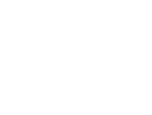

<div align="center">
    
</div>

<p align="center">
<a href="https://docs.fossunited.org/">

</a>
<a href="https://frappe.io/framework/">

</a>
<a href="https://vuejs.org/">

</a>
<a href="https://tailwindcss.com/">

</a>
</p>


<h1 align="center">FOSS United Platform</h1>

<p align="center">
  <strong>An open-source community management platform for FOSS enthusiasts across India</strong>
</p>

<p align="center">
  Built with ❤️ by the FOSS United Foundation to foster collaboration, innovation, and growth in the Free and Open Source Software ecosystem.
</p>

## ✨ Features

- **👥 User Profiles**: Showcase contributions, maintain portfolios, and manage activities
- **🏛️ FOSS Communities**: Join or manage local FOSS communities and clubs
- **📅 Event Management**: Organize and participate in community events, hackathons, and conferences
- **🎯 Grant Programs**: Track and apply for community grants and initiatives
- **📊 Analytics Dashboard**: Monitor platform statistics and community growth
- **🎫 Ticketing System**: Streamlined event registration and ticket management
- **📝 CFP Management**: Call for proposals and submission review system

## 🚀 Quick Start

### Prerequisites
- Python 3.10+
- Node.js 16+
- Docker & Docker Compose
- uv (Python package manager)

### Installation

1. **Clone the repository**
   ```bash
   git clone https://github.com/fossunited/fossunited.git
   cd fossunited
   ```

2. **Setup development environment**
   ```bash
   # Using Docker (Recommended)
   uv add frappe-manager
   fm create foss.localhost
   fm start
   fm shell

   # Install the app
   bench get-app https://github.com/fossunited/fossunited.git
   bench install-app fossunited
   ```

3. **Access the platform**
   - Main site: `http://foss.localhost`
   - Dashboard: `http://foss.localhost/dashboard`

For detailed setup instructions, see our [development documentation](https://docs.fossunited.org/development/).

## 🛠️ Tech Stack

### Backend
- **Framework**: [Frappe Framework](https://frappe.io/framework/) (Python)
- **Database**: MariaDB
- **Caching**: Redis
- **Task Queue**: RQ (Redis Queue)

### Frontend
- **Dashboard**: Vue.js 3 + TailwindCSS
- **Admin Interface**: Frappe's built-in UI
- **Maps**: OpenStreetMap integration

### Development Tools
- **Linting**: [Ruff](https://docs.astral.sh/ruff/) for Python
- **Formatting**: [Prettier](https://prettier.io/) for frontend files
- **Spell Check**: [Vale](https://vale.sh) for documentation
- **Package Management**: [uv](https://github.com/astral-sh/uv)

## 📡 API Reference

The platform provides REST APIs for various functionalities:

### Statistics API
- `GET /api/method/fossunited.api.stats.get_platform_stats` - Get comprehensive platform statistics
- `GET /api/method/fossunited.api.stats.get_event_stats` - Get event-related statistics
- `GET /api/method/fossunited.api.stats.get_user_stats` - Get user-related statistics

### Other APIs
- Profile management, event management, ticketing, and more
- Full API documentation available in the [developer docs](https://docs.fossunited.org/)

## 🧪 Development

### Pre-commit Hooks

For automatic linting and formatting before commits:

```bash
uv add pre-commit
pre-commit install
```

### Testing

Run the test suite:

```bash
bench run-tests --app fossunited
```

### Code Quality

- **Python**: Follows PEP 8 with Ruff linting
- **JavaScript/Vue**: ESLint + Prettier formatting
- **Documentation**: Vale for spell checking and grammar

## 🤝 Contributing

We welcome contributions from developers of all skill levels! Here's how you can help:

### Ways to Contribute
- 🐛 **Bug Reports**: Use our [issue templates](.github/ISSUE_TEMPLATE/bug_report.md) to report bugs
- ✨ **Feature Requests**: Suggest new features via [feature request template](.github/ISSUE_TEMPLATE/feature_request.md)
- 📖 **Documentation**: Help improve docs using our [documentation template](.github/ISSUE_TEMPLATE/documentation.md)
- 💻 **Code**: Submit pull requests for bug fixes, features, or improvements

### Getting Started
1. Fork the repository
2. Clone your fork: `git clone https://github.com/your-username/fossunited.git`
3. Create a feature branch: `git checkout -b feature/your-feature-name`
4. Make your changes and test them
5. Submit a pull request

### Guidelines
- Follow our [contribution guidelines](CONTRIBUTING.md)
- Use [conventional commits](https://www.conventionalcommits.org/) for commit messages
- Ensure all tests pass and code is properly formatted
- Update documentation for any new features

### Community
- 📋 [Discussion Forum](https://forum.fossunited.org/)
- 💬 [Telegram Community](https://t.me/fossunited)
- 🐦 [Twitter/X](https://x.com/fossunited)

## 📜 Code of Conduct

We are committed to providing a welcoming and inclusive environment for all contributors. Please read our [Code of Conduct](CODE_OF_CONDUCT.md) before participating.

## 🔒 Security

For security-related issues, please see our [Security Policy](SECURITY.md). Do not report security vulnerabilities through public issues.

## 🙏 Acknowledgments

- **FOSS United Foundation** for building and maintaining this platform
- **Frappe Framework** community for the amazing framework
- **All Contributors** who help make FOSS United better every day

## 📄 License

This project is licensed under the AGPL-3.0 License - see the [LICENSE](LICENSE) file for details.

By contributing to FOSS United, you agree that your contributions will be licensed under the AGPL-3.0 License.

---

<p align="center">
  <strong>Made with ❤️ by the FOSS United Community</strong>
</p>

<p align="center">
  <a href="https://fossunited.org">🌐 Website</a> •
  <a href="https://docs.fossunited.org">📚 Documentation</a> •
  <a href="https://forum.fossunited.org">💬 Forum</a> •
  <a href="https://t.me/fossunited">💬 Telegram</a>
</p>
