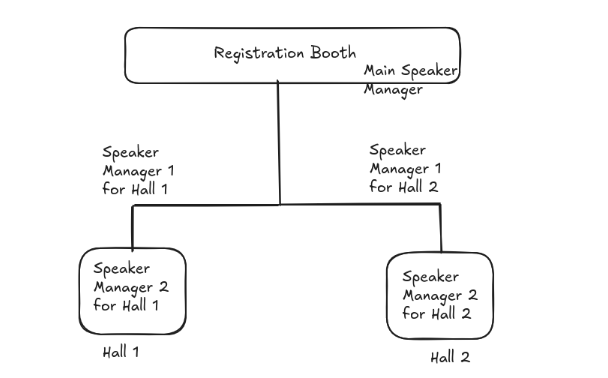

# Speaker Management

**Who is this for?** - Speaker Managers who coordinate with speakers before and during the event.

**Time required** - This is a pre-event and on-ground responsbility. You will be required to be in touch with your assigned speakers after their talk is approved by the program committee, specifically during the event. You will spend not more than 5 hours a week pre-event.

1. **Who is a speaker manager?**
    A speaker manager is the point of contact from the program committee who coordinates with speakers after their talk slot has been approved. Before the approval, the program committee will coordinate with them directly.

2. **Which speaker do I contact?**
    Historically, speaker managers are responsible only for the speakers of the main tracks (i.e. not for the [devrooms](event-first-timers-guide#4-about-indiafoss)). Devroom managers and volunteers are required to coordinate with their speakers. If there are other smaller rooms that are part of the main room and require your assistance, the program committee will let you know.

3. **Contacting speakers**
    As a speaker manager, you will be assigned a list of speakers that you will the point of contact for. When you are assigned the list, make sure to reach out to them using a [template](indiafoss-email-templates.md#1-speaker-manager-speaker-first-contact) shared with you by the team, along with your contact details (phone number and telegram). This template will ask them to share their presentation and contact info among other things. If you have concerns with sharing your phone number, please flag it to the team as early as possible. If you haven't received contact details of speakers during the week of the conference, flag it to the full time staff and they'll get it for you.

    > **Note** : For all communications to speakers, make sure to cc speakers.indiafoss@fossunited.org

4. **How is the speaker management team structured?**
    As of IndiaFOSS 2026, there are 2 speaker managers per auditorium along with one main speaker manager who will be near the registration booth as the first point of contact for all speakers.

    Let's take the example of IndiaFOSS 2026 where we had 2 main track auditoriums and 5 speaker managers in total. Each auditorium is assigned 2 speaker managers, one of who is stationed outside the auditorium to look around the whole venue for a speaker, if the need arises. The one assigned inside the audi should be inside at all times. 

    {width=80%}

5. **Will the same speaker manager remain in the audi forever?**
    No! We make sure rotate roles during shifts so you can experience other aspects of IndiaFOSS.

6. **Escalations**
    Speaker managers within an audi should escalate to the speaker manager right outside. Whereas the speaker manager right outside an audi should escalate to the main speaker manager at the registration booth. Most queries will get resolved at this point at the main speaker manager would have met all speakers who have checked in for the day. If you still face issues, the main speaker manager should escalate to overall volunteer managers who are also full time foundation staff.

> We encourage all speaker managers to share contact numbers amongst yourself and make sure you don't depend on other people to do this for you.

## Checklist

Here's a checklist for you to follow throughout the event:

### Pre-event

- [ ] Share your contact details with speakers assigned to you
- [ ] Make sure to collect presentation of speakers assigned to you. If someone prefers using their own laptop, make sure to remind them that they need to do AV checks at least an hour before their talk. They are also encouraged to have screen recordings of demos as the internet connection at the venue may not be dependable all the time.
- [ ] Get contact details of speakers
- [ ] Connect with other speaker managers

### For Main Speaker Manager

- [ ] Be at the registration booth at all times
- [ ] Collect the contact info of all speakers who checkin. Also mark their attendance somewhere to be double sure
- [ ] Inform all speakers of the Audi and the time of their presentation
- [ ] Make sure they are connected with their speaker manager POC and know the venue to navigate themselves

### For Speaker Managers in the Audi

- [ ] Make sure your speakers have done their A/V checks
- [ ] Make sure you have a buffer of at least two speakers at all times
- [ ] Make sure to connect the speakers with the audi manager/volunteers as well
- [ ] Remain in touch with your speaker manager partner who is stationed outside the audi

### For Speaker Managers outside the Audi

- [ ] Make sure to be in touch with the main speaker manager to meet speakers who checkin
- [ ] Make sure you also find time to go check out other sections of the conference as and when you get time

