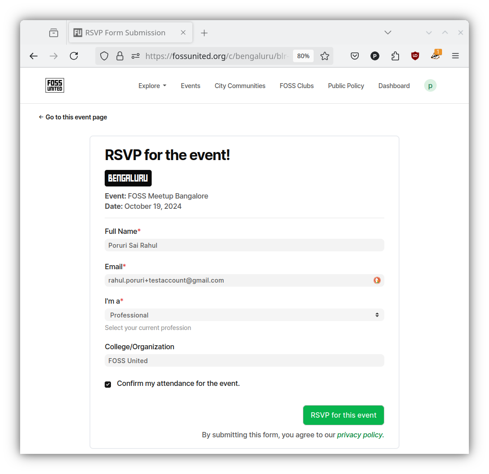

# RSVP to an event

Events like Monthly meetups usually require attendees to RSVP for the
event. This helps the event organizers plan accordingly e.g. purchase snacks
and beverages.

## RSVPing to an event

**NOTE:** RSVP-ing to an event does not require you to have a Profile.

- Visit the RSVP tab for the event and click on the `"RSVP for the event"`
  green button

- Fill in the form with the necessary information. Please note that if you are
  logged in, the Platform will auto-fill some of the information i.e. the Full
  Name and Email fields.

- You should receive an email from FOSS United after you successfully submit
  the form.

**NOTE:** Please note that some of the events might need additional
information from the participants e.g. phone numbers. This is because some of
the venue partners where the meetups are organized might require the attendees
to provide their phone numbers to enter the building or office premises.

## Updating your RSVP

If you are unable to attend an event that you previously RSVP'ed to, we
request you to update the status of your RSVP. Like we mentioned earlier, the
RSVP information is used by the organizers to make decisions about the meetup
e.g. tea/coffee and snacks ordered for the event. Accurate RSVP information
prevents wasting time, energy, money, and food.

- Visit the RSVP tab of the event that you previously RSVP'ed to

- Uncheck the `"Confirm your attendance!"` field from the RSVP form and click
  on the `"Update RSVP Form"` button.

