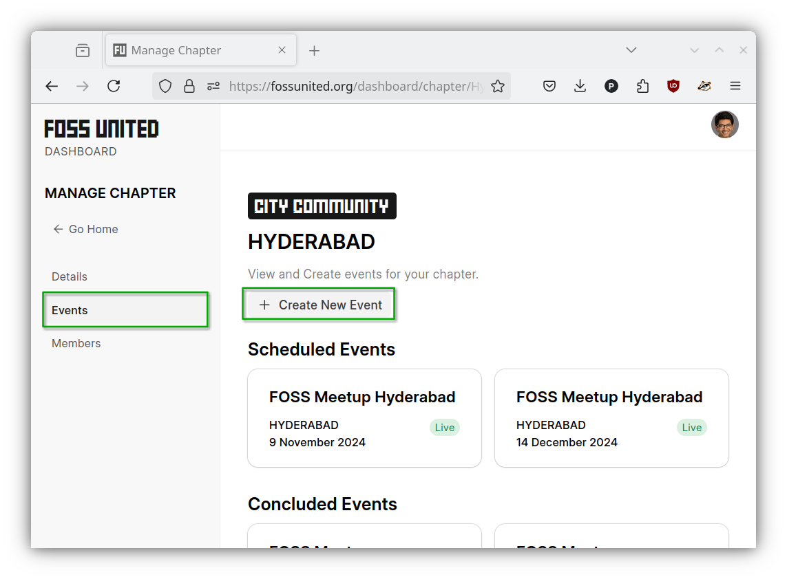
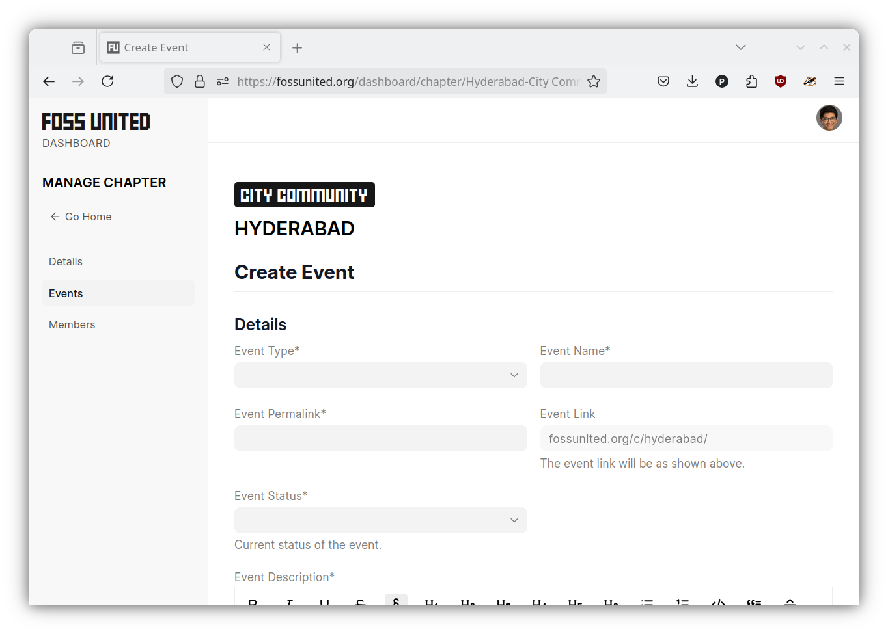
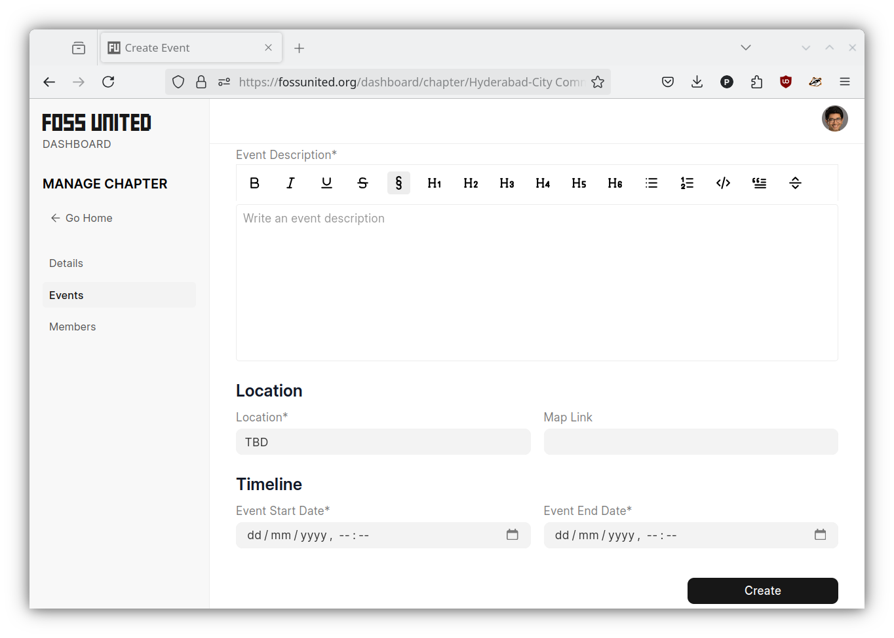
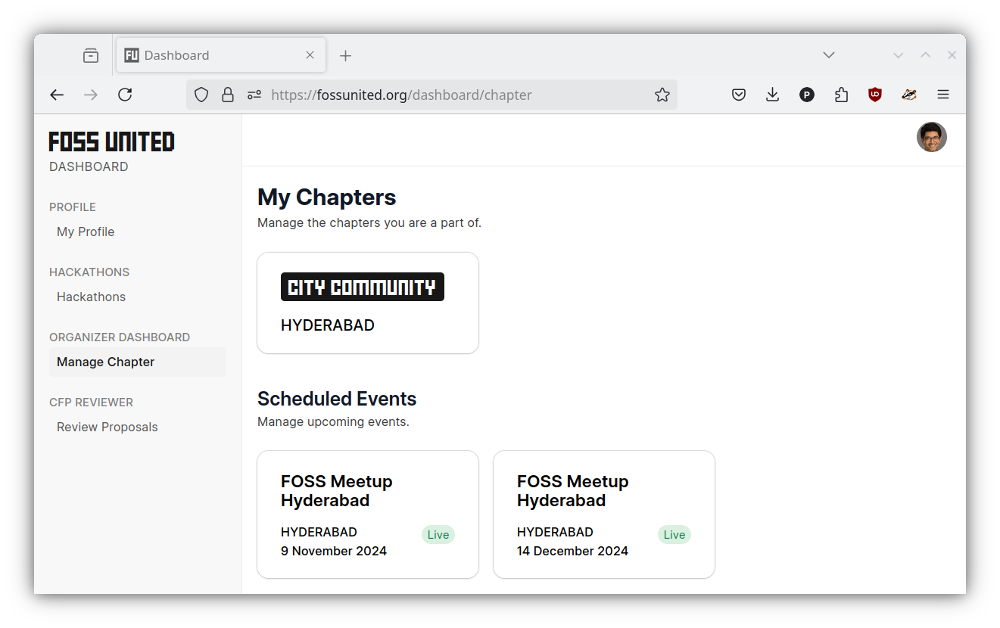
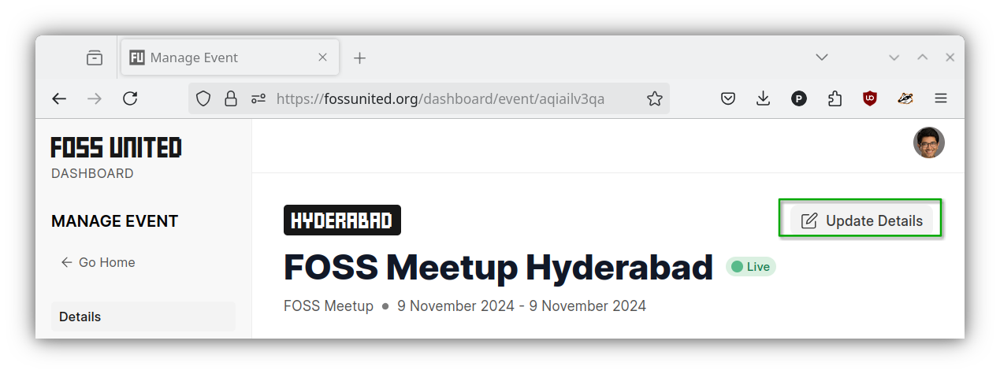
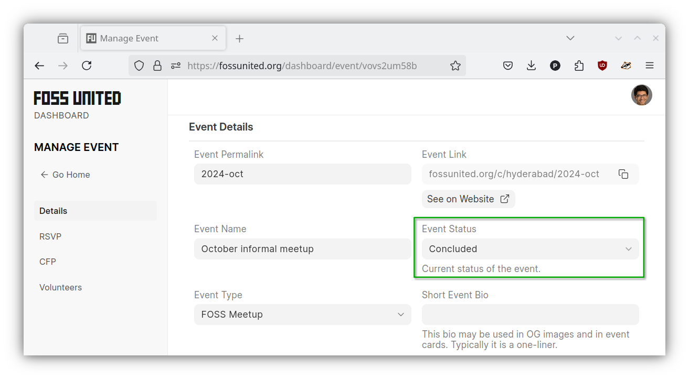

# Event management

## Create event

- To schedule a new event, open the Community page where the event is being
  organized. Within the chapter, open the `"Events"` page and click on the
  `"Create New Event"` button as seen below.

- Please provide the requested information in the form

| Create event                                      | (...)                                                |
| ------------------------------------------------- | ---------------------------------------------------- |
|  |  |

- For monthly meetups, please use the following options
  - Please select `"FOSS meetup"` in the `"Event Type"` dropdown
  - Please use `"FOSS Meetup {city name}"` for the `"Event Name"`
    e.g. `"FOSS Meetup Hyderabad"`
  - Please use `YYYY-MMM` for the `"Event Permalink"` e.g. `2024-nov`
  - Please use `"Live"` as the `"Event Status"`
  - Please select the start datetime and the end datetime for the event

After an event is created successfully, you should be able to see it in the
`"Manage Chapter"` page.

## Update event

Information about the event e.g. location of the event can be updated after
the event is created. To update an event, open the event from the
`"Scheduled Events"` section, update the necessary information, and click on
the `"Update Details"` button.

## Conclude event

After an event has concluded, please update the `"Event Status"` from `"Live"`
to `"Concluded"`.

**NOTE:** The event will not be displayed under the `"Past Events"` section of
the chapter page unless the `"Event Status"` is updated. We have observed
events "disappear" from the public pages of chapters because the
`"Event Status"` doesn't get updated and the events aren't displayed under
`"Upcoming Events"` because the datetime for the event is in the past.

