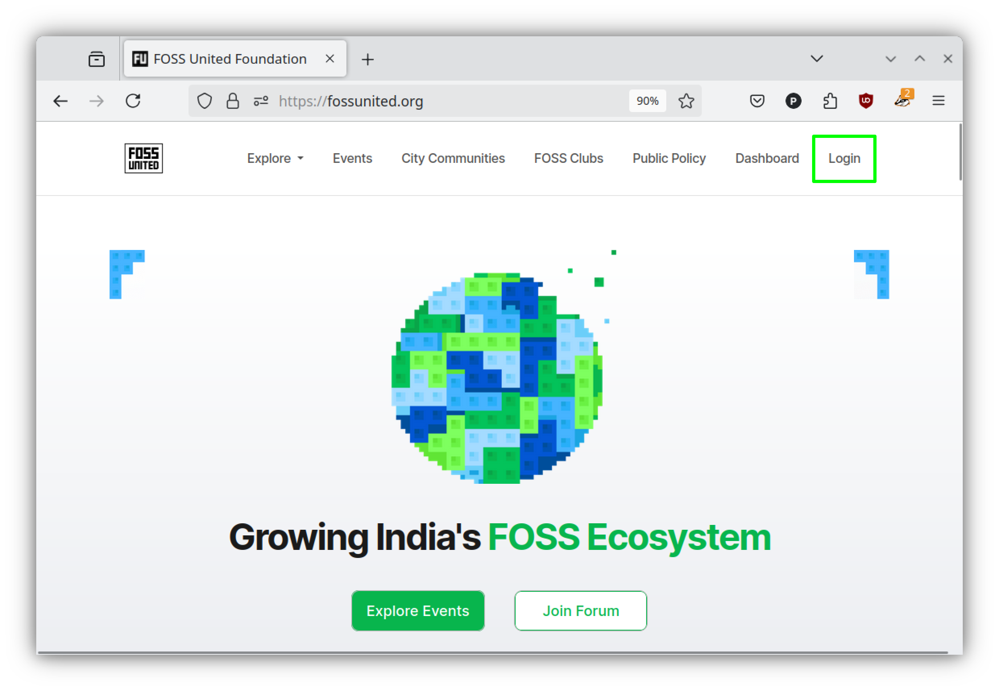
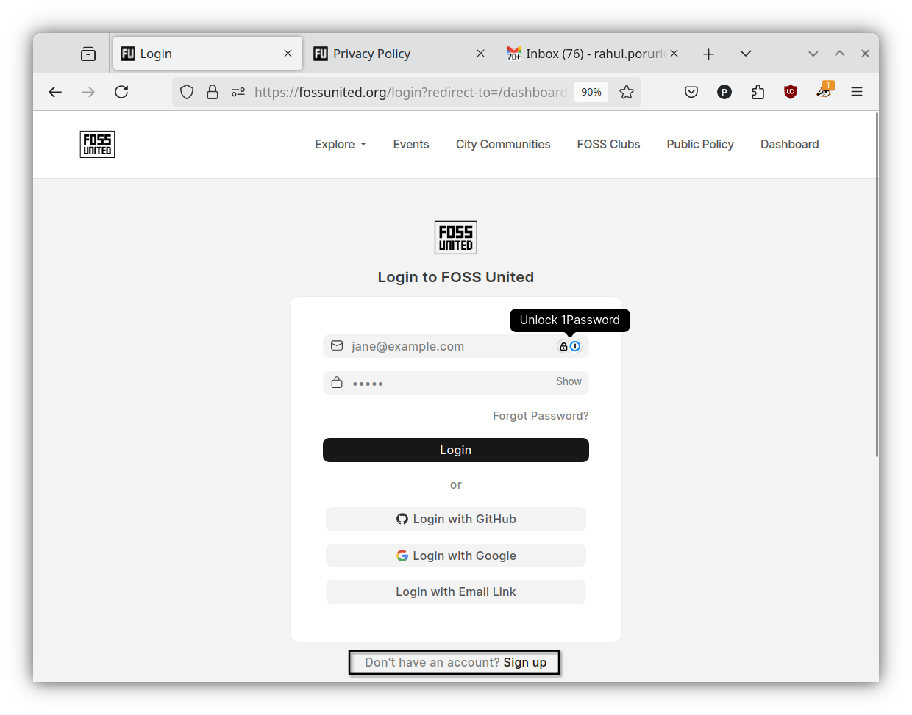
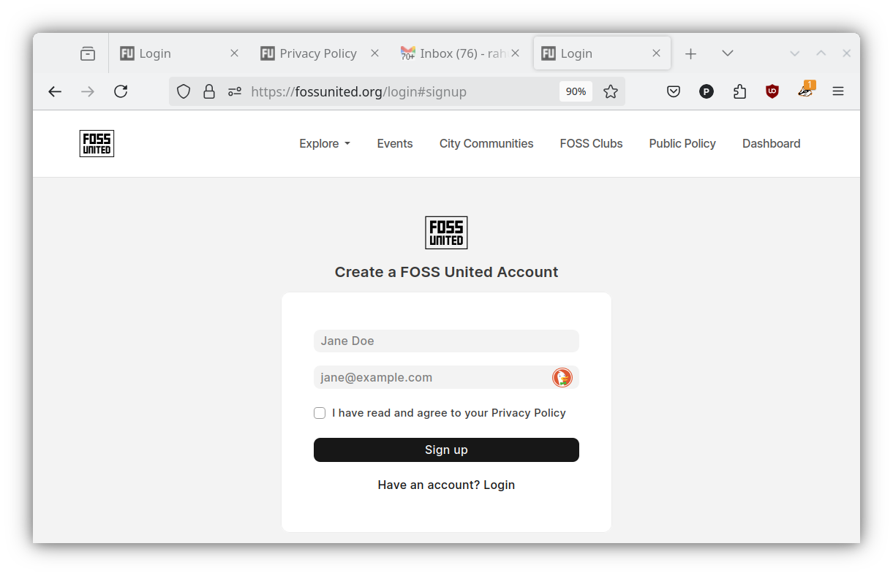
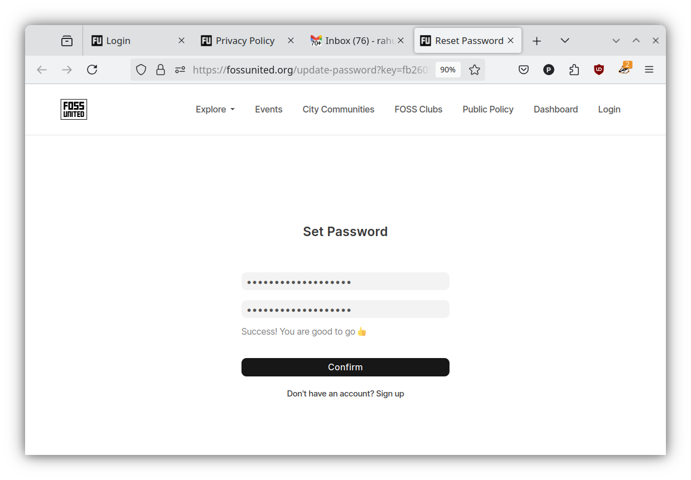

# Creating your Profile

- If you don't have a Profile, use the `"login"` button to initiate the
  process of creating a Profile

- In the `"login"` page, use the `"Sign up"` button at the bottom to create a
  Profile

- Please provide your name or an alias and an email address.

  **NOTE:** Please note that it is not possible to change the email address
  associated with your Profile once it is created. The name or alias can be
  updated.

- After completing the previous step, you should receive an email from us.
  The email will provide a link where you can set the password for the
  Profile.

Congratulations, you have created a FOSS United Profile.
