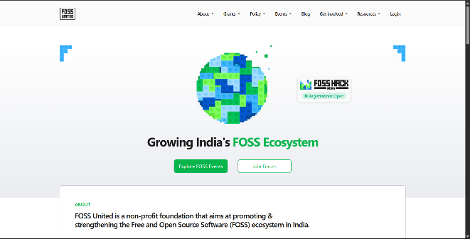
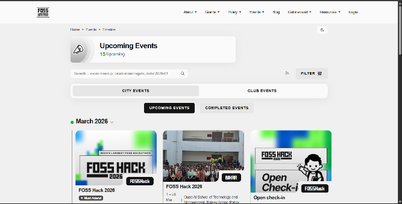
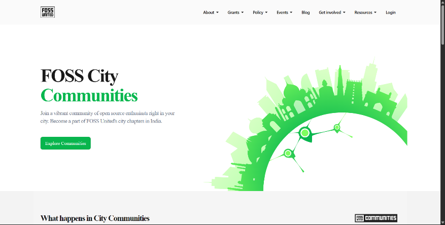
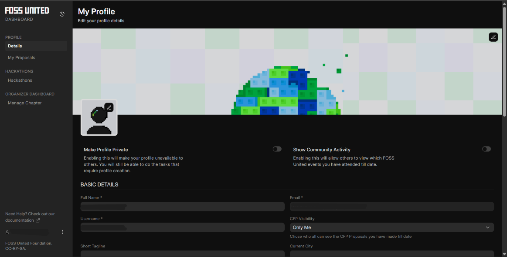
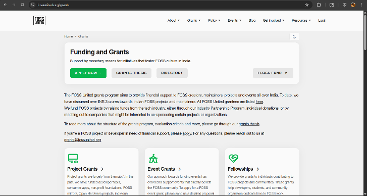

# FOSS United Codebase Walkthrough

This document helps new contributors understand how the FOSS United website maps to the codebase and where different features are implemented. The goal is to reduce the time spent exploring the repository before making a first contribution.

## Overview

The FOSS United platform is built on the Frappe Framework.

Main parts of the system:

### Backend:
Python (Frappe framework)

### Frontend:
Frappe templates + Vue dashboard

### Database:
MariaDB

Supporting services:
Redis, background workers, file storage.

### High level structure:

fossunited/
 ├── fossunited/        → Main application code
 ├── dashboard/         → Vue based admin dashboard
 ├── www/               → Website pages (routes)
 ├── templates/         → Shared UI templates
 ├── doctype/           → Core data models
 ├── public/            → Static assets
 ├── docs/              → Documentation


## How Website Pages Map to Code
### Home Page

#### Screenshot:


#### Location:
```sh
fossunited/www/
```

#### Description:

This directory contains the main website routes. Each file typically represents a route in the website.

#### Example mapping:

www/index.html → fossunited.org
www/events → fossunited.org/events
www/grants → fossunited.org/grants

New contributors working on website UI will usually start here.

---

### Events Pages

#### Screenshot:


#### Location:

```sh

fossunited/fossunited/doctype/event/
```

#### Description:

Events are one of the core features of the platform. This module handles:

- Event creation
- Event display
- RSVP system
- Tickets
- Schedules

#### Important files:

event.py → backend logic
event.json → schema definition
event.js → frontend logic

If you want to improve events UI or logic, this is a good starting place.

---
### Chapters / Communities

#### Screenshot:


#### Location:
```sh
fossunited/fossunited/doctype/chapter/
```

#### Description:

Handles city chapters and local communities.

#### Includes:

- Chapter profiles
- Chapter events
- Volunteers

New contributors can work here for:

- UI fixes
- Filtering improvements
- Documentation improvements

---

### User Profiles

#### Screenshot:


#### Location:

```sh
fossunited/foss_profiles/doctype/foss_user_profile/
```

#### Description:

Handles user profiles including:

- User info
- Participation history
- Community involvement

#### Key files:

```sh
foss_user_profile.py
foss_user_profile.json
```

---

### Grants

#### Screenshot:


#### Location:

```sh
fossunited/www/grants/
```

#### Description:

Handles:

- Grant applications
- Grant listings
- Grant tracking

Good area for contributions related to:

- UI improvements
- Validation improvements
- Documentation

---

### Proposals / CFP System

#### Location:

```sh
fossunited/fossunited/doctype/proposal/
```

#### Description:

Handles:

- Conference proposals
- Talk submissions
- Review workflows

Includes:

- Submission system
- Review process
- Approval workflow

---

### Dashboard (Admin UI)

#### Location:

fossunited/dashboard/

#### Description:

Vue based interface used by organizers and volunteers.

#### Handles:

- Event management
- Community management
- Approvals
- Administration tools

#### Key structure:

```sh
dashboard/src/components → UI components
dashboard/src/pages → Dashboard pages
dashboard/src/router → Routes
dashboard/src/services → API logic
```

Frontend contributors will mostly work here.


## Core Architectural Concepts

### DocTypes

Frappe applications revolve around DocTypes.

#### DocTypes define:

- Data structure
- Backend logic
- Permissions
- UI forms

Example:
```sh
doctype/event/
doctype/chapter/
doctype/profile/
```
#### Each contains:
```sh
.json → schema
.py → backend logic
.js → UI logic
```
Understanding DocTypes is essential before contributing major features.


## Static Assets

#### Location:
```sh
fossunited/public/
```
#### Contains:

- Images
- CSS
- JavaScript
- Icons

Used across website pages.

## Templates

### Location:

fossunited/templates/

Contains reusable UI templates used across multiple pages.

### Examples:

- Navbar
- Footer
- Cards

Good place for UI consistency improvements.

## Suggested Starting Points For New Contributors

If you are new to the project, good first areas:

- Documentation improvements
- UI fixes
- Accessibility improvements
- Small bug fixes
- Tests

### Easier directories:
```sh
docs/
www/
dashboard/src/components
```
Avoid initially:

- Core DocType logic
- Database migrations
- Authentication flows

## Typical Contribution Flow

Recommended exploration order:

1. Read README
2. Setup project locally
3. Explore www folder
4. Explore dashboard
5. Explore doctype modules
6. Pick good first issue

## How Features Are Typically Structured

Example flow for Events:

User visits:
```sh
events page
```
Route handled by:
```sh
dashboard/src/pages/events
```
Data comes from:
```sh
fossunited/fossunited/doctype
```
Backend logic:
```sh
event.py
```
Frontend display:
```sh
templates + dashboard components
```
Understanding this flow makes debugging easier.

## Where To Add New Pages

New website pages:
```sh
www/
```

New backend features:
```sh
doctype/
```
New dashboard features:
```sh
dashboard/src/pages
```
## Tips For Contributors

Before contributing:

- Understand DocType structure
- Check similar implementations
- Search existing features
- Ask in issue if unsure

Helpful commands:
```sh
bench start
bench build
yarn dev (dashboard)
```

## Final Notes

This document is meant to reduce onboarding friction for new contributors. If something is unclear while exploring the codebase, consider improving this document as part of your contribution.

Contributions to improve this walkthrough are welcome.


