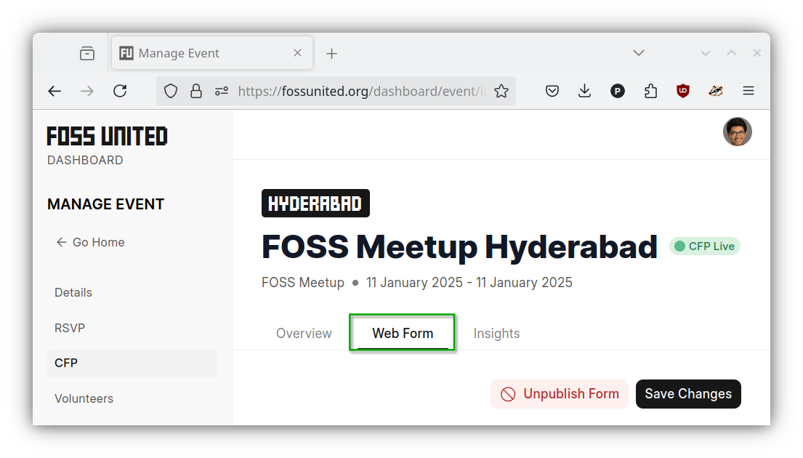

# Manage event proposals

## Create a Call for Proposals (CFP)

Once an event is created, you should be able to create the CFP form for the
event.

- Please open the CFP tab under the Event page and click on the
  `"Create Form"` button

- Provide the necessary information for the CFP form and click on the
  `"Create"` button, If necessary please use the `"Add Custom Field"` button
  under the `"Custom Fields"` section of the form to request additional
  information from the proposers e.g. prerequisites that the participants
  are expected to know about

| Create CFP form                                    | Standard fields                                    | Custom fields                                                   |
| -------------------------------------------------- | -------------------------------------------------- | --------------------------------------------------------------- |
|  |  |  |

- Once created, the Event page on the Dashboard should reflect the fact that
  the CFP is "live"

## Update the CFP

- If necessary, you can use the `"Web Form"` tab to update the form e.g.
  allow proposal edits, allow only talk proposals

## Close the CFP

- The CFP form can be unpublished and the CFP tab on the event page can be
  hidden if necessary e.g. deadline for the CFP is past

| Hide CFP Tab                               | Unpublish CFP form                                     |
| ------------------------------------------ | ------------------------------------------------------ |
|  |  |

## Download proposal info

- CFP submissions from the proposers can be displayed and downloaded from the
  `"Insights"` tab.

**NOTE:** Please note that responses to custom fields in the CFP form cannot
be downloaded using the `"Download"` button on the `"Insights"` tab. Please
reach out to the Foundation if and when that information is required.
