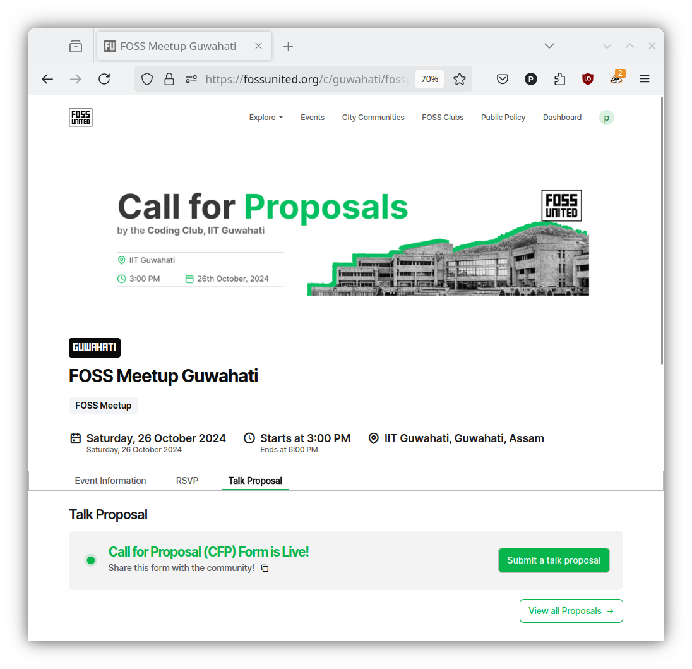
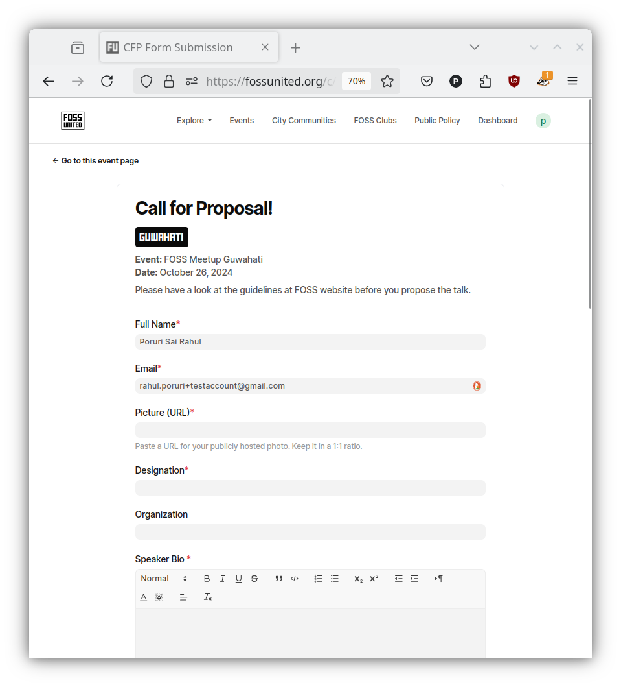
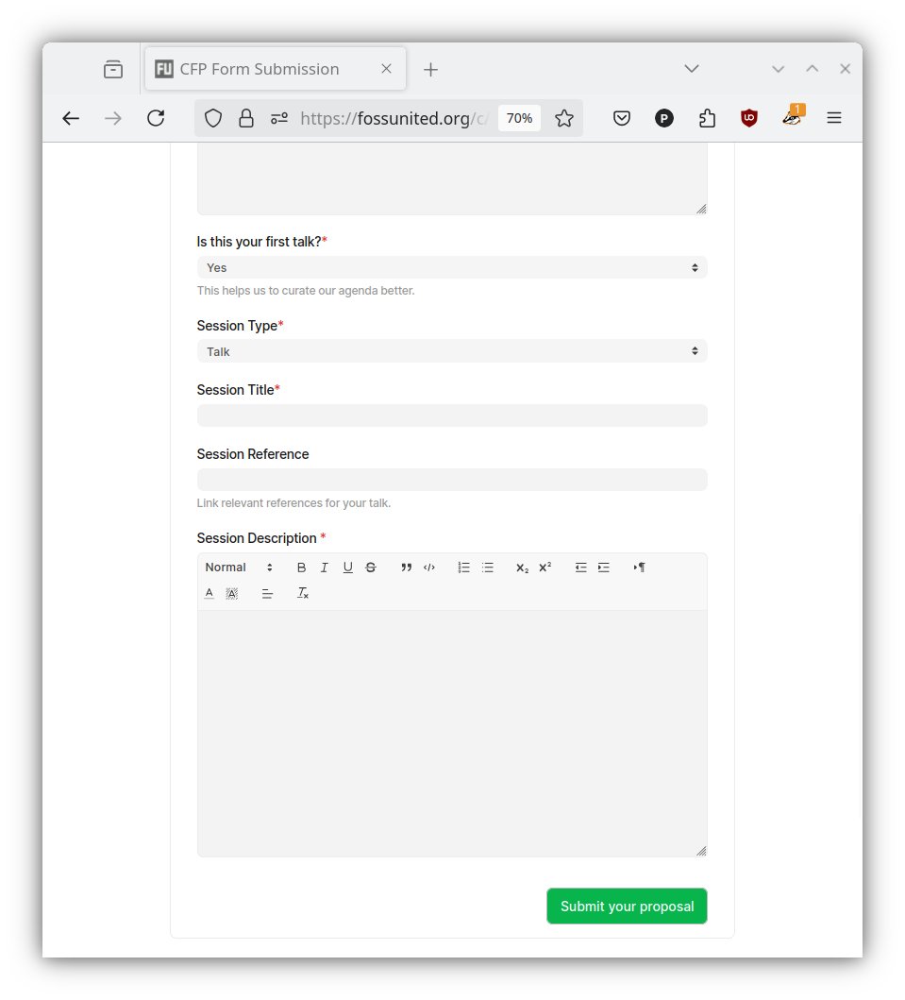
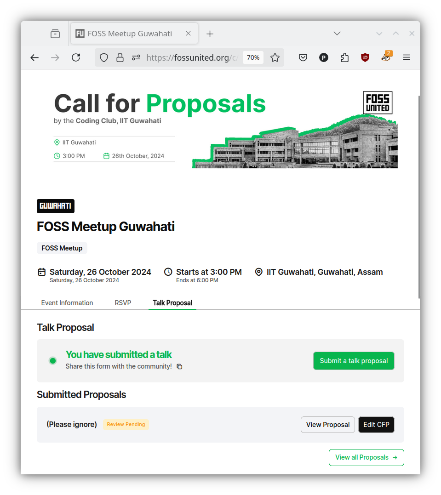
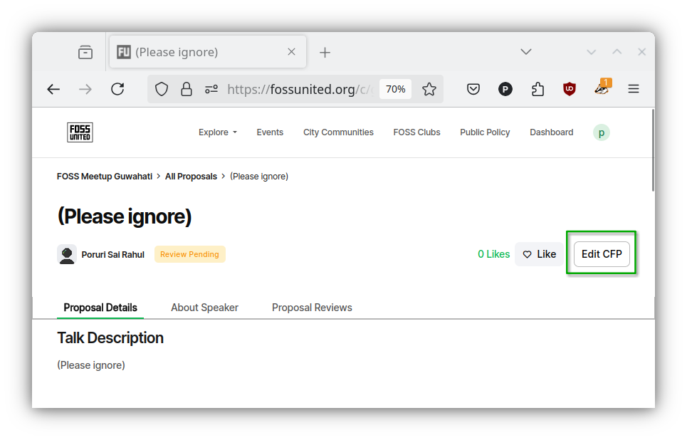
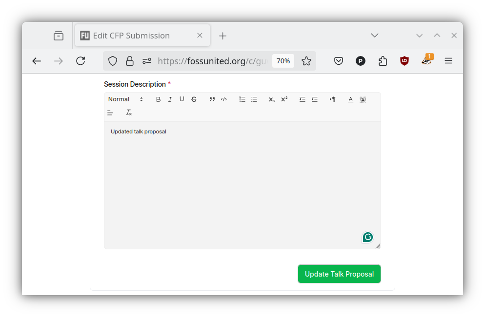

# Call for Proposals (CFP)

Sessions at FOSS United events are usually selected from a pool of proposals.
After the event is announced, the event organizers usually request the
Community to submit proposals e.g. talk proposals, workshop proposals. As the
scheduled date of the event approaches, the organizers choose the final sessions
from the submitted proposals with help from reviewers.

**NOTE:** Submitting a proposal to a FOSS United event does not require you to
have a Profile.

## Submit a Proposal

- In order to submit a proposal for a FOSS United event, visit the
  `"Talk Proposal"` tab on the event page and click on the
  `"Submit a talk proposal"` green button.

- Please fill in the requested details on the `"Call for Proposal!"` form. If
  you are logged-in, the Platform will auto-fill some of the information on
  the form i.e. Full Name, Email. Before submitting, we request you to read
  the [guidelines for proposals](https://forum.fossunited.org/t/talk-proposal-guidelines-for-a-foss-conference-meetup/1923)

**NOTE:** Please note some of the events might need additional information
from the proposers.

| CFP form                               | (...)                                   |
| -------------------------------------- | --------------------------------------- |
|  |  |

- You should receive an email from FOSS United after you successfully submit
  the form.

## Update a Proposal

You can access submitted proposals from the `"Talk proposal"` tab of the
event. You might want to update the submitted proposal e.g. based on review
comments from the event organizers. You can either use the `"Edit CFP"` button
on this page or on the page that displays information about your proposal.

| Talk proposal tab                                             | Proposal page                                                    |
| ------------------------------------------------------------- | ---------------------------------------------------------------- |
|  |  |

- After updating the proposal as necessary, please click the
  `"Update Talk Proposal"` button to save the updates.

