# Manage event RSVP

This page explains how a FOSS Club or City Chapter member can create a RSVP page for their events.

Before you proceed further, make sure to have [listed your event](create-event.md) under your club or chapter on the FOSS United platform.

## Create RSVP form

Once an event is created, you should be able to create the RSVP form for the
event.

- Please open the RSVP page under the Event page and click on the
  `"Create RSVP Form"` button

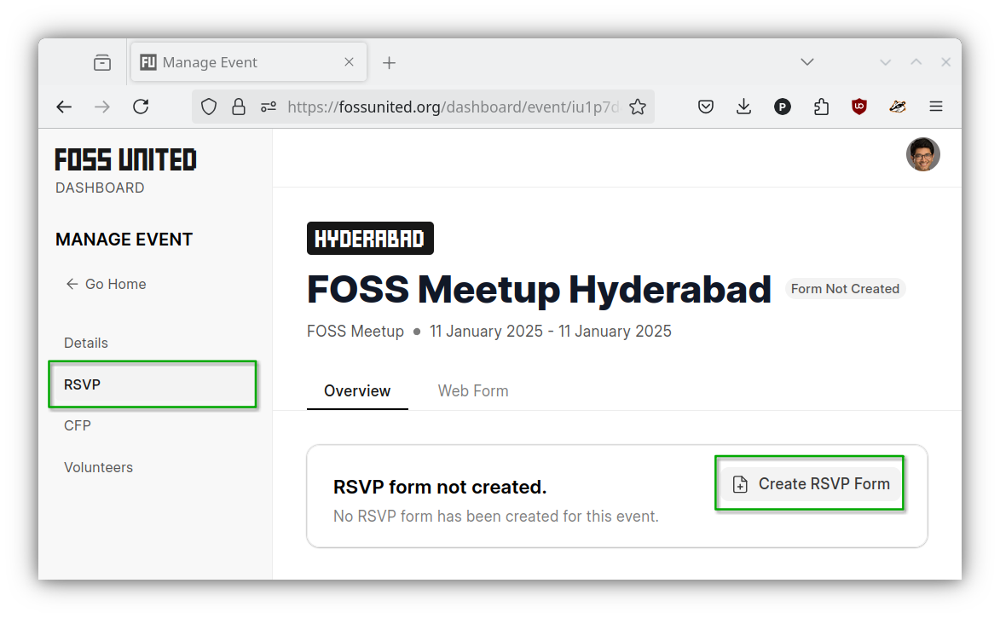

- Provide the necessary information for the RSVP form and click on the
  `"Create"` button. If necessary please use the `"Add Custom Field"` under
  the `"Custom Fields"` section of the form to request additional information
  from the attendees e.g. mobile phone numbers

| Create RSVP Form                                | Standard fields                                   | Custom fields                                                      |
| ----------------------------------------------- | ------------------------------------------------- | ------------------------------------------------------------------ |
| 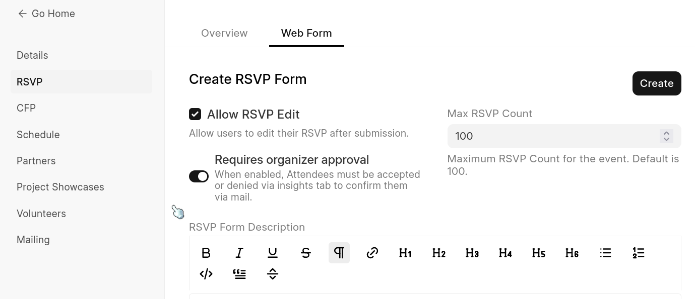 | 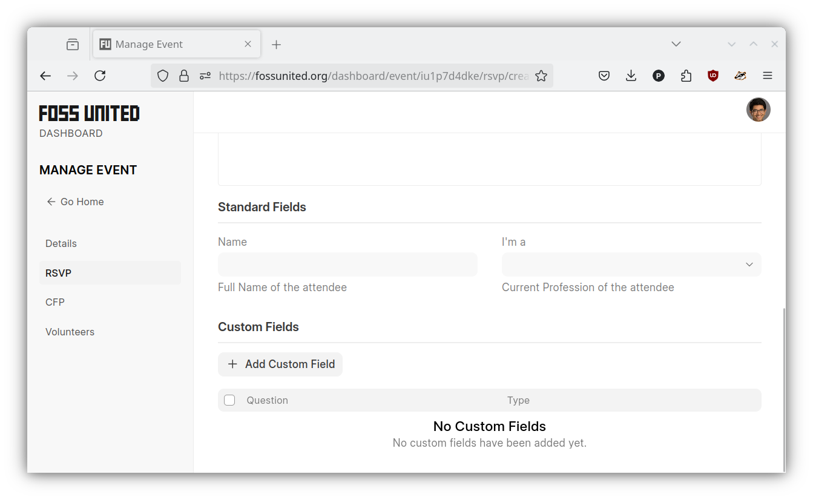 | 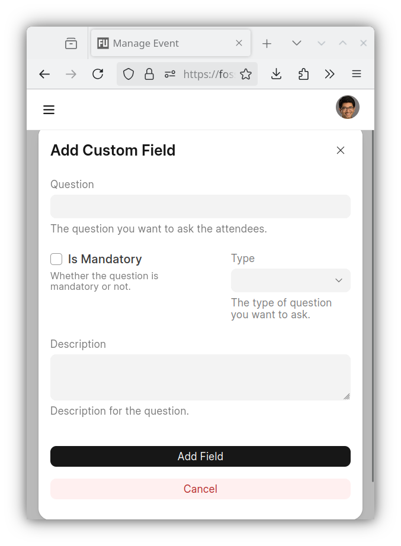 |

- Once created, the Event page on the Dashboard should reflect the fact that
  the RSVP is "live"

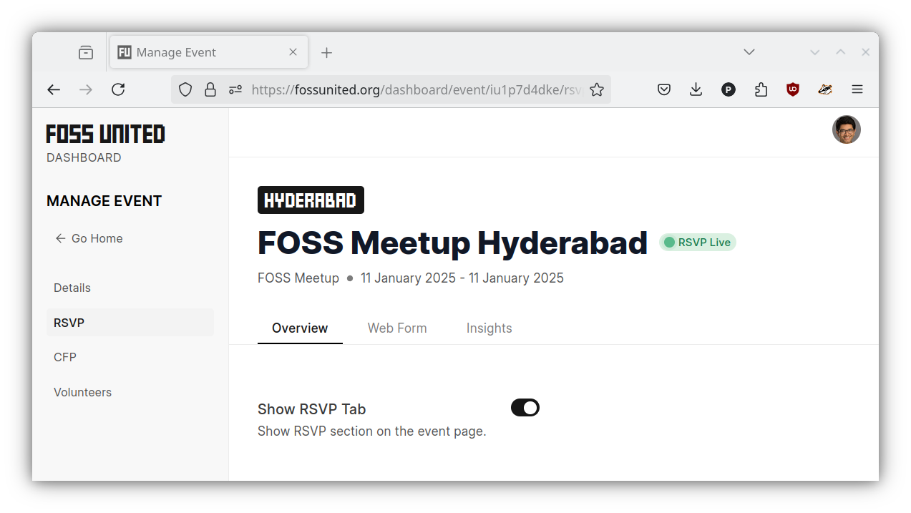

## Restrictive access to event

You can manage RSVP to be restrictive based on organizer's approval basis.

Simply you can enable the toggle switch on "Require organizer approval" while creating RSVP as shown above or you can also make the change via editing RSVP later if you decide so.
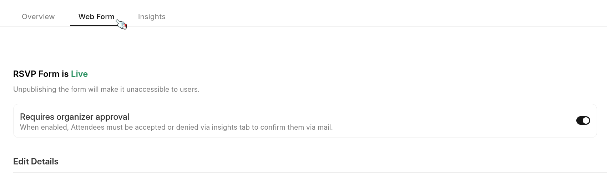

In dashboard RSVP insights tab you'll see four group in list view for "Attendance status". Attendees will get a confirmation email on status if accepted or denied their request.

Note: On clicking reject you'd get a fair warning (popup) to confirm rejection.

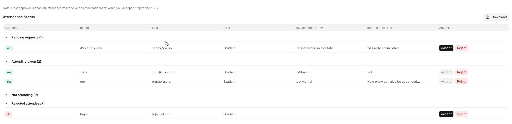

## Update RSVP form

- If necessary, you can use the `"Web Form"` tab to update the form e.g.
  allow RSVP edits, increase Max RSVP count.

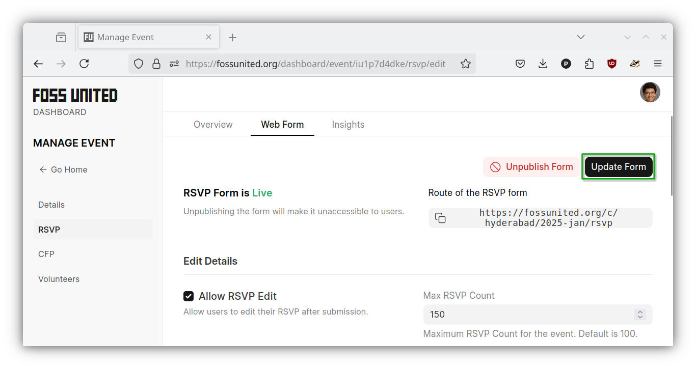

## Un-publish RSVP form

- The RSVP form can be unpublished and the RSVP tab on the event page can be
  hidden if necessary e.g. Max RSVP count has been reached

| Hide RSVP Tab                                | Un-publish RSVP form                                      |
| -------------------------------------------- | -------------------------------------------------------- |
| 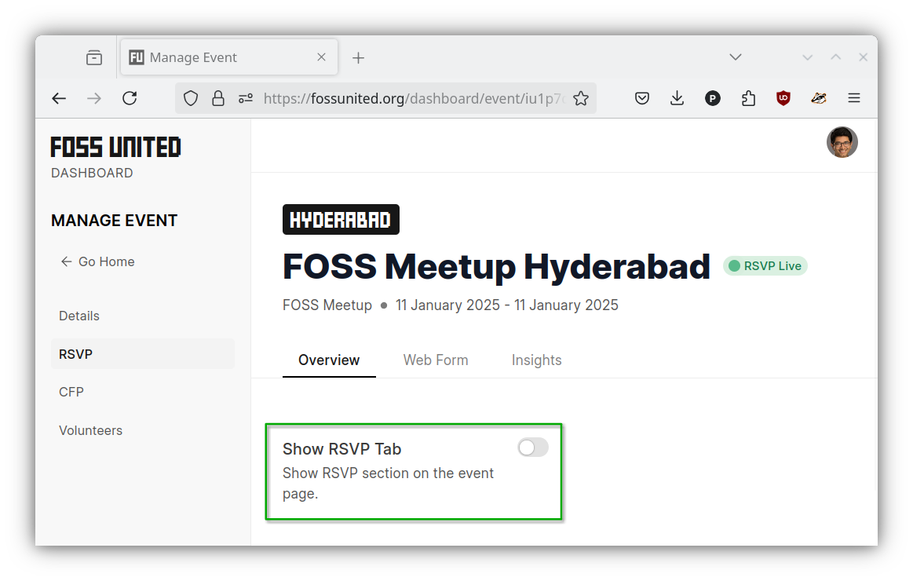 | 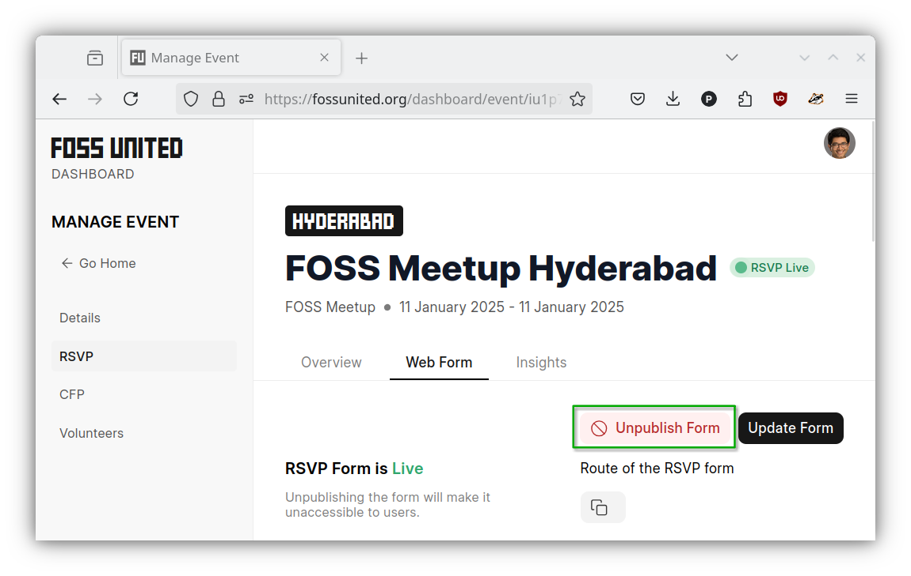 |

## Download RSVP info

- RSVP submissions from the attendees can be displayed and downloaded from the
  `"Insights"` tab.

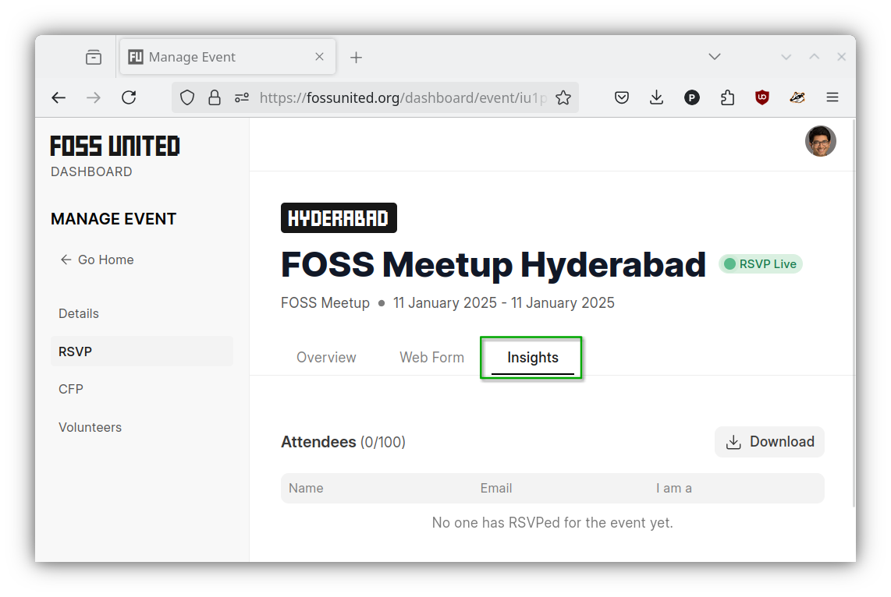

As of October 2025 you can download the full RSVP responses (custom fields) in CSV format.

## Event Check-ins

Attendees are expected to do self check-in via their [Edit RSVP form](./attend-event.md#checkin-to-an-event)

This will reflect on the dashboard insights in ListView based on date and this information can also be download as CSV.

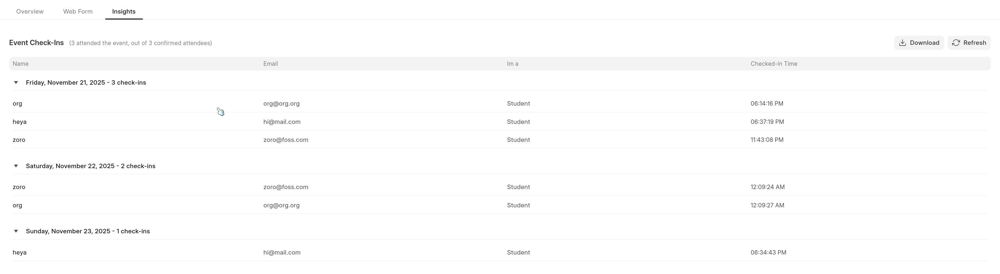

As of [Jan 2026] Organizers can also Check-in under RSVP Insights tab

- Click the "Check-in" button to checkin the attendee for that day of the event (if its multiple days event)
- Note: Check-in button will only work during the day of event (start to end day only), same for self-checkin.
- An attendee can be checked-in only once a day.
- Check-in button acts a toggle, so you can undo a check-in by clicking the same "Checked-in today" button.

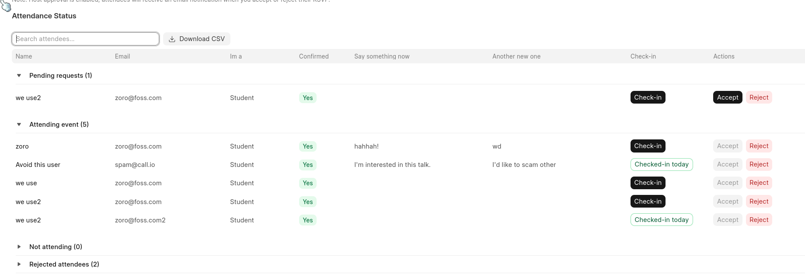
PS: the accept or reject is a feature available when you enable [restrictive access](#restrictive-access-to-event) to the event as informed above.
