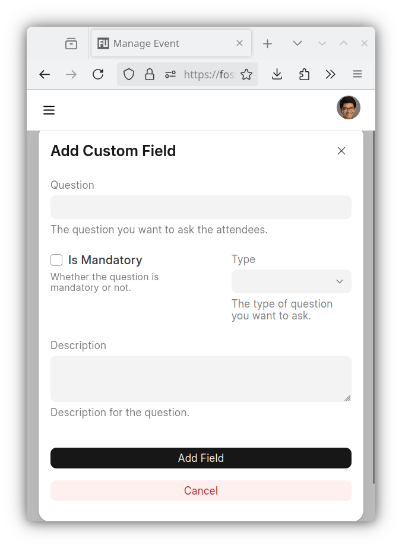

# Manage event RSVPs

## Create RSVP form

Once an event is created, you should be able to create the RSVP form for the
event.

- Please open the RSVP page under the Event page and click on the
  `"Create RSVP Form"` button

- Provide the necessary information for the RSVP form and click on the
  `"Create"` button. If necessary please use the `"Add Custom Field"` under
  the `"Custom Fields"` section of the form to request additional information
  from the attendees e.g. phone numbers

| Create RSVP Form                                | Standard fields                                   | Custom fields                                                      |
| ----------------------------------------------- | ------------------------------------------------- | ------------------------------------------------------------------ |
|  |  |  |

- Once created, the Event page on the Dashboard should reflect the fact that
  the RSVP is "live"

## Update RSVP form

- If necessary, you can use the `"Web Form"` tab to update the form e.g.
  allow RSVP edits, increase Max RSVP count.

## Unpublish RSVP form

- The RSVP form can be unpublished and the RSVP tab on the event page can be
  hidden if necessary e.g. Max RSVP count has been reached

| Hide RSVP Tab                                | Unpublish RSVP form                                      |
| -------------------------------------------- | -------------------------------------------------------- |
|  |  |

## Download RSVP info

- RSVP submissions from the attendees can be displayed and downloaded from the
  `"Insights"` tab.

**NOTE:** Please note that responses to custom fields in the RSVP form cannot
be downloaded using the `"Download"` button on the `"Insights"` tab. Please
reach out to the Foundation if and when that information is required.
