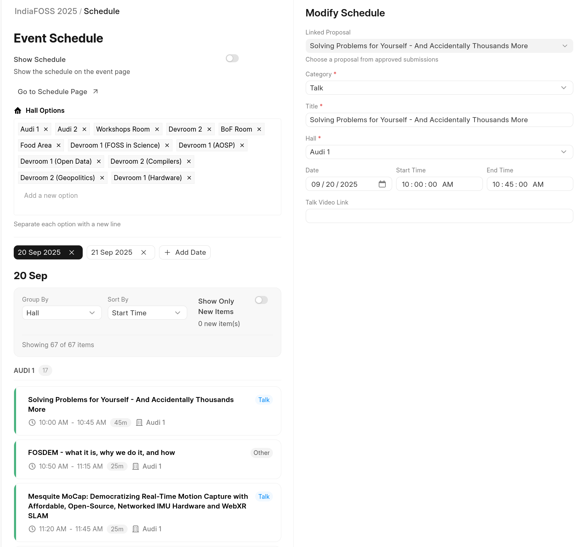
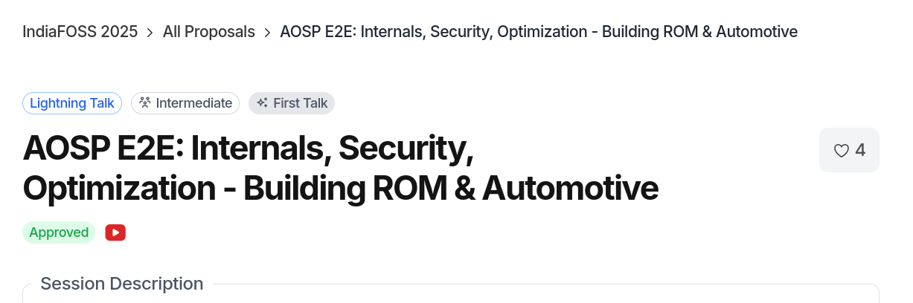

# Creating the event schedule

After the review volunteers submit reviews for the event proposals, the event
volunteers have the responsibility to select the final talks for the event.

When talks have been finalized, its easier to make schedule for the events.
Navigate to Events dashboard > Schedule

You can add Hall names to group where talks takes place. Then you can choose a date when talks occur.

When you click on date option, you'd likely see an placeholder event or simply empty list.

You can click on "+ Add Schedule" to add each proposal as talk by choosing a category, hall and the allotted time.

You can skip adding linked proposal if category is break or "Opening note". Ideally everything else is expected go with accepting a proposal and linking them for schedule as talk.

- Talk video link (URL) can be added (ideally after event ends) to provide video link of the recorded talk or if before (some previous talk given) to show up in schedule cards.
  This will also reflect on the CFP page to show YouTube icon to link to this talk video.

- For long schedule you can use the grouping and sort by feature to navigate faster with the whole agenda.
- You can see the schedule agenda via "Go to schedule page"

- Schedule page also provides downloading whole agenda in various formats.
