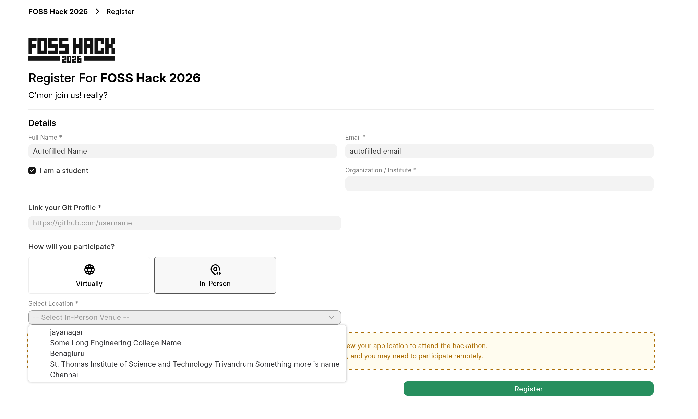
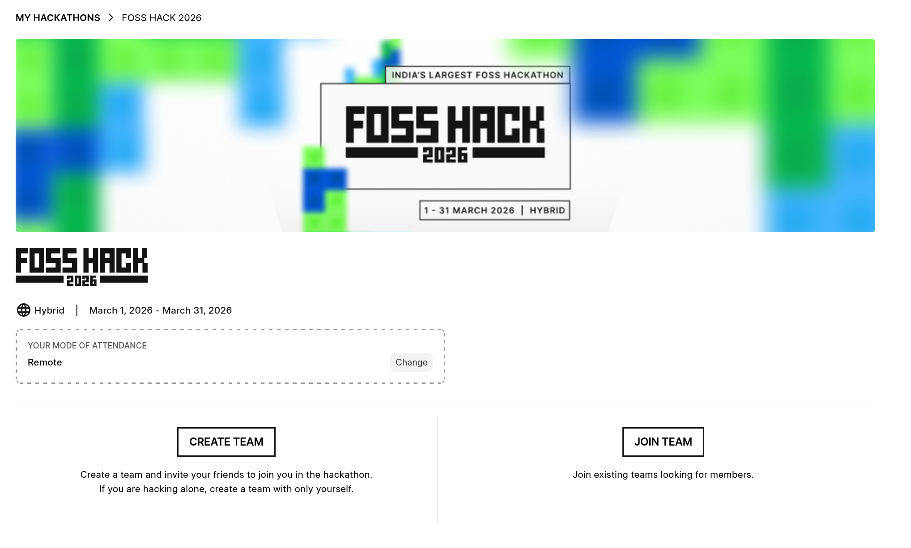
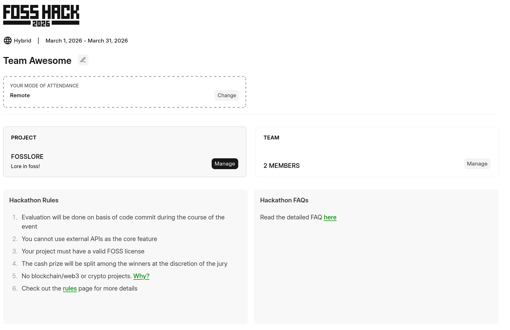
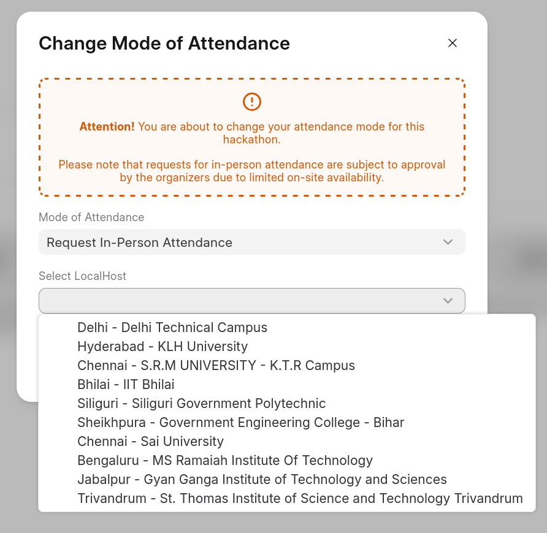
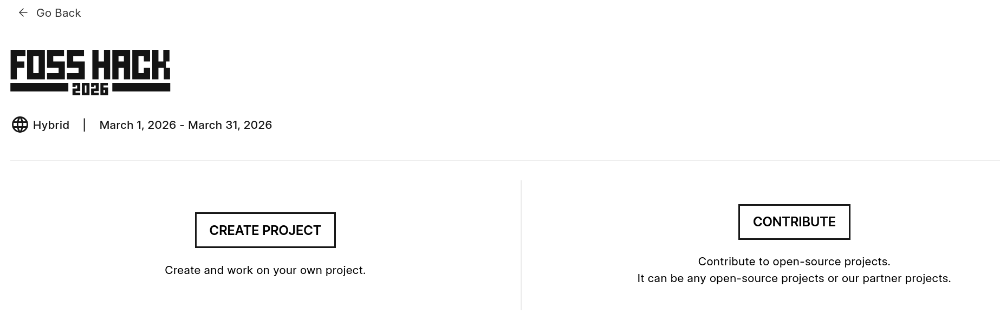
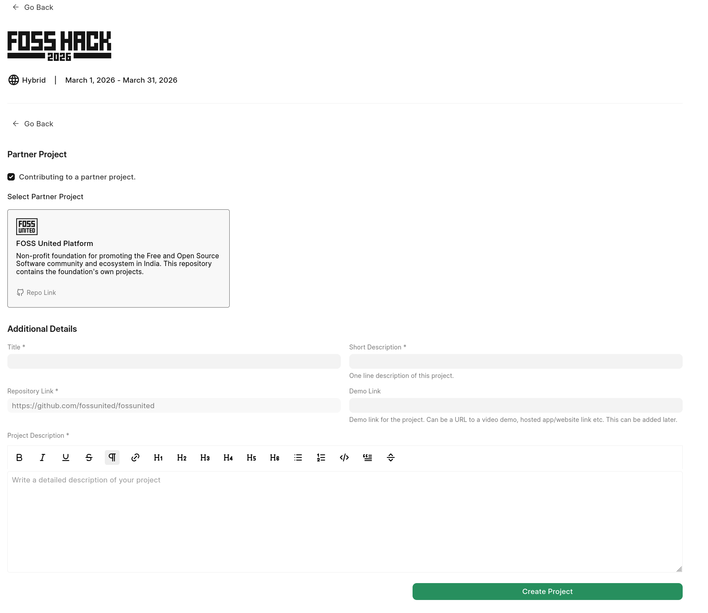
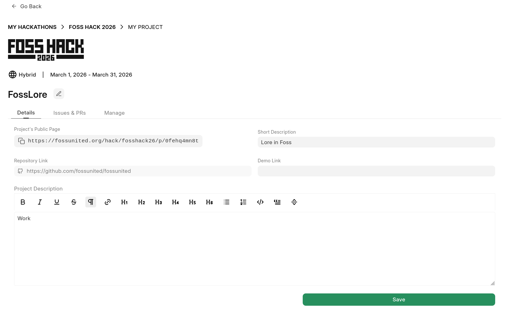

# FOSS Hack Participation

FOSS Hack is, a hybrid hackathon to promote Free and Open Source Software by bringing together students and professionals to build or extend FOSS projects. It is India's Largest FOSS Hackathon.

Before you hop-on to registering, its highly suggested to read the hackathon description, guidelines and rules. This gives you overall clarity and brief of the workflow. This document only contains information regarding platform (dashboard) related interactions.

## Register for hackathon

- You need to login to fossunited account to register for the hackathon
- Please choose valid details as required. If attending Online choose `Virtual` or else select an In-person venue you'd like to attend.
You'll be only allowed to attend offline if the localhost accepts and confirms you to attend (received via email)

Note: In case in-person venue are empty, please await until listing all other localhosts. for example, FOSS hack 26 has total of 10 localhosts to choose.

Once you register you'll be prompted to create or join a team.

## Enter a Team

- Even if you are participating **alone**, you need to create a team for yourself (alone) and proceed to add projec there.
- You can join a team via invite link (if created and shared with you)

This is the main dashboard you'll see after you enter into a team.

## Mode of attendance
- You can also change your mode of attendance in this page.

If you request to attend in-person then select the localhost you'd like to apply for.
You will only be able to attend if localhost accepts your request, Please wait for localhost to accept or reject (you'll receive email on same). They get to see your git repo for evaluating themselves, so please keep it updated.

## Add Project

- Once you create/join a team, together whole team sees a shared "project" that is added.
- You can create a own project based on problem statements or contribute to existing partner projects and link them showing your contributions via issues/PRs.

- If contributing to partner project, please check the box and choose the available projects. Please see FAQs to know how many partner projects will be added.

- Once you add project you can manage it now by updating the description.
  - Its suggested to keep this description in `Readme` style since page will render it.
  - You can also link some issues and PRs in second tab as this will also help evaluators to see the progress of important changes.

After adding your project, you can come back to [My hackathons](https://fossunited.org/dashboard/my-hackathons) dashboard to update the post.

- You can view all projects submitted to a hackathon here: [fossunited.org/hack/fosshack26/projects/all](https://fossunited.org/hack/fosshack26/projects/all) (change the permalink year/name)

# Reference

Please go through these resources made for you especially before raising doubts anywhere. If anything is missing anywhere, please do feel free to raise and ask in official threads and forums.
It is advised to prefer our [forum](https://forum.fossunited.org), or [telegram group](https://t.me/fosshack) or [Fossunited platform](https://github.com/fossunited/fossunited/) git repo for platform related issues.

1. [Code of Conduct](https://fossunited.org/code-of-conduct)

2. [FOSS Hack Rules, Guidelines and FAQs](https://forum.fossunited.org/t/foss-hack-rules-guidelines-faq/3334)

3. [Hackathon Project Ideas](https://forum.fossunited.org/t/hackathon-ideas/159) shared by community

4. [View all hackathon projects](https://fossunited.org/hack/fosshack26/projects/all)

5. [List all FOSS hackathon](https://fossunited.org/hack)
