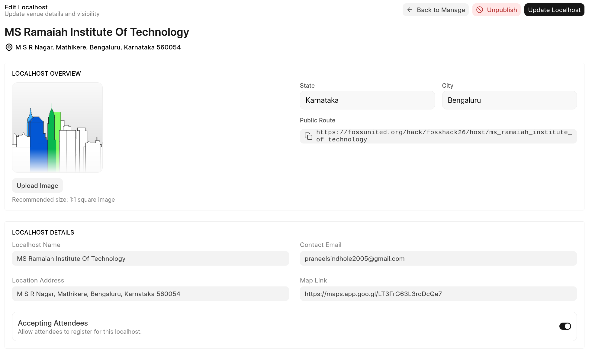
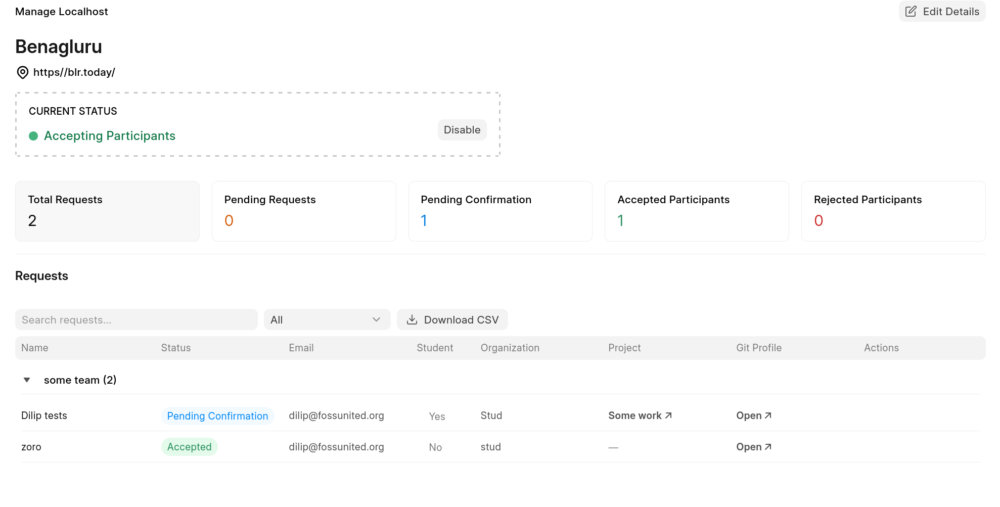
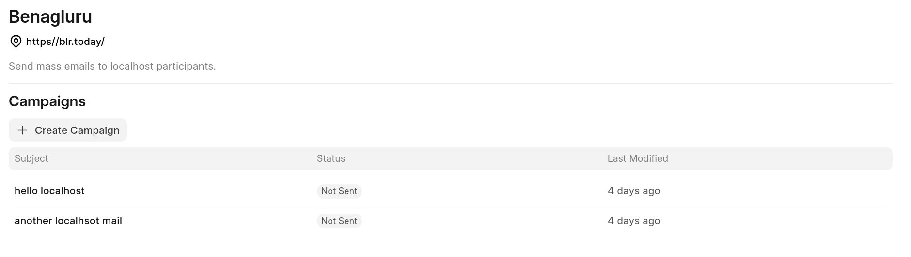

# FOSS Hack Localhost

- Our dashboard lets you manage the foss hackathon localhost requests.
- Each attendee when accepted receive an email message for them to confirm their attendance as well.
  Until they accept, they will be kept as "Pending confirmation"
- When attendees are rejected, they receive email on same and no more will be able to request for attending your localhost.

Once you're granted access to localhost desk, please head over to [Localhost Dashboard](https://fossunited.org/dashboard/localhost) and choose the localhost.

Sidebar has 3 items which lets you manage the request and information.

## Edit Localhost Info

This page shows the overview information about your localhost, please keep the information updated here.
- It is suggested to also add Location address (text) and map link (preferably [OSM Maps](https://osmapp.org)) to help participant to know.

## Manage Attendees

- A List View of participants is shown grouped by Teams requesting to attend the localhost for the Hackathon.
- You can click on each list to know more about them via their Git profile or if any project is linked.
- You can use the filter button to filter by "status" or Download the CSV data to process it yourself.
- "Action" column has two button to accept or deny their request for attending.
  Both of these are communicated via auto-email sent when their status changes.

## Localhost Mailing

- When each attendee is accepted, they are automatically added to your localhost email group.
- You can make use of mailing feature to send email to all accepted participants.
Or if you wish to do it on your own, you can download CSV and grab the email column and do "BCC" on all emails.

- Please read [Event mailing](event_mailing.md) to know how to use.
- You'll only see Recipients as "Event Participants" with count, those are the participants email that have been accepted. You can go ahead and choose to send email to them all.
- Before sending, you can do test sending email yourself.

