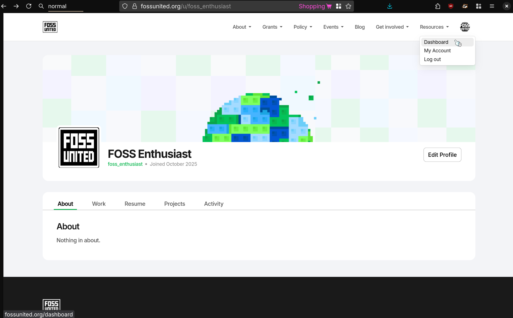
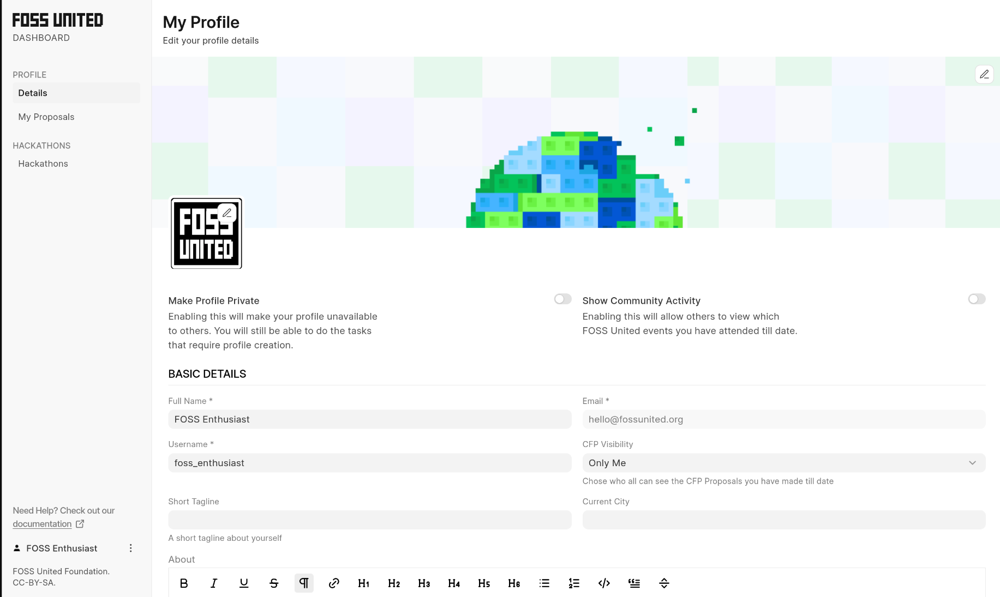
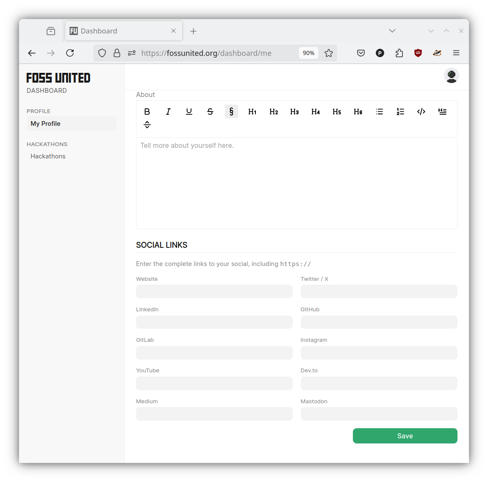

# Managing your Profile

- Your Profile page should look like what you see below

- Click on the `"Edit Profile"` button which will take you to [Dashboard page](https://fossunited.org/dashboard/me) to add or change information about yourself

**Note:** Toggling the `"Make Profile Private"` button will prevent people
from seeing your information on the Platform

| Edit Profile                                 | Add social links                                         |
|----------------------------------------------|----------------------------------------------------------|
|  |  |

- We also suggest you to enable "Show Community Activity" which will show all your activity and events you've attended.

We also plan to improve activity part of users, please share us your thoughts by [opening discussion](https://github.com/fossunited/fossunited/issues/new).
