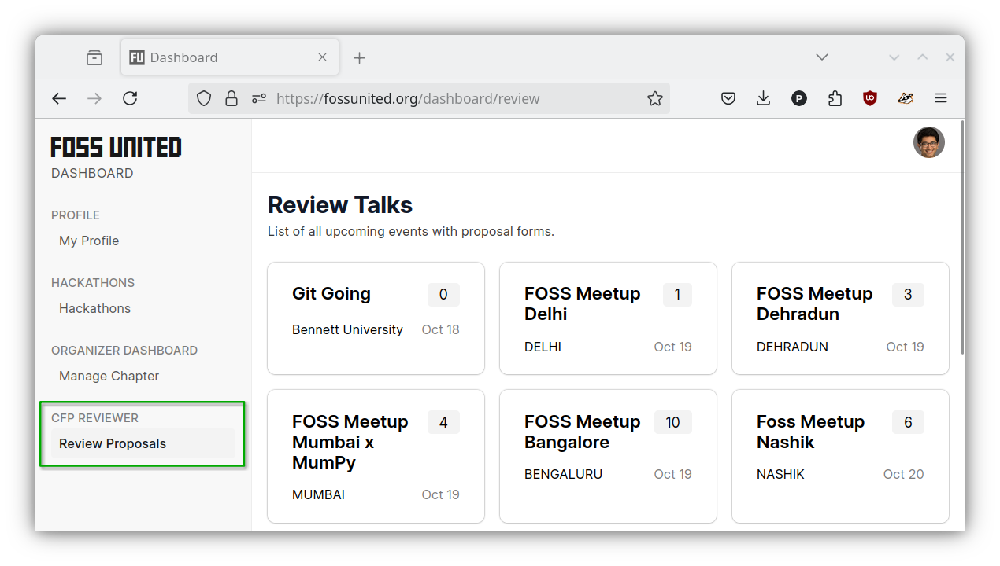
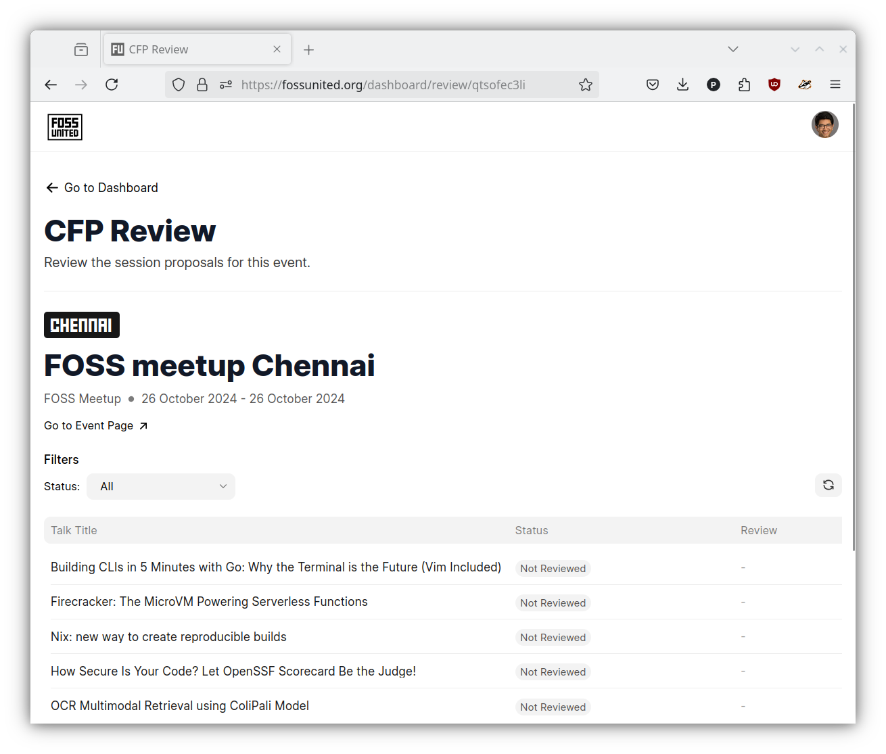
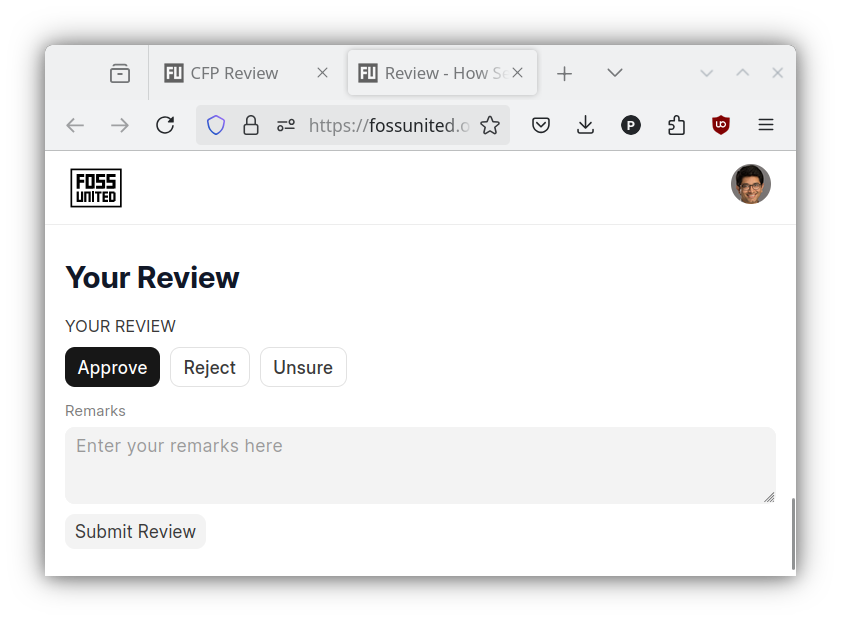
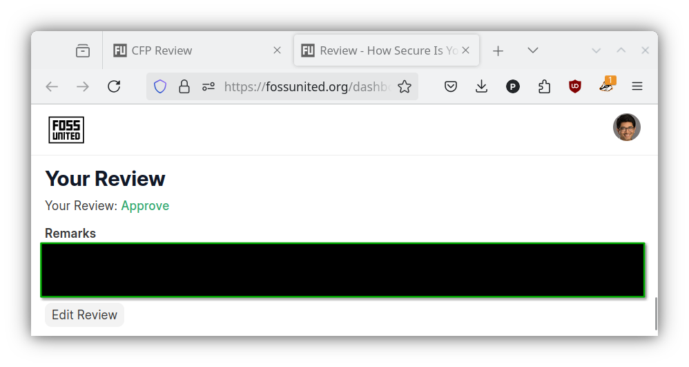

# Reviewing proposals

Usually, after the proposal submissions are closed for an event, the
volunteers begin following up with reviewers to comment on the proposals. The
FOSS United Community has a distributed team of volunteer reviewers. The
distributed nature of the reviewers is an effort to prevent the chapter
volunteers from favoring some proposers over others and to improve
transparency in the decision making process.

Reviewing community proposals is a hard job and it becomes especially hard if
you want to provide meaningful feedback to the proposers to enable them to
improve the proposals. Effectively reviewing proposals is a learned skill
and if you have experience writing and reviewing proposals, and you are
interested in volunteering with the FOSS United Community, please reach out to
the Foundation.

Once you're added as a reviewer, you should be able to see a new
`"Review Proposals"` page on the Dashboard.

## Submitting a review

- Click on one of the events listed in the `"Review Proposals"` page to see
  the list of submitted proposals

- Click on one of the proposals to see detailed information about the
  proposal and to submit a proposal

**NOTE:** We humbly request the reviewers to provide constructive criticism of
the proposals. One word reviews are stronlgy discouraged. Almost all proposals
can be improved in some way or another and it is the reviewers' responsibility
to provide this necessary feedback to the proposers. There exists an
equilibrium between the proposers and the reviewers - if the reviewers are
unnecessarily harsh, proposers become demotivated over time and the likelihood
of repeat proposals from the same proposer goes down. On the other hand, if
the reviewers approve all proposals without providing meaningful feedback, the
proposers don't have any incentive to improve their proposals over time, also
leading to fewer sound proposals. The long-term quality of proposals and talks
in the FOSS United Community depends on the reviewers.

## Updating a review

- Reviews can be updated by clicking on the `"Edit Review"` button on the
  proposal

