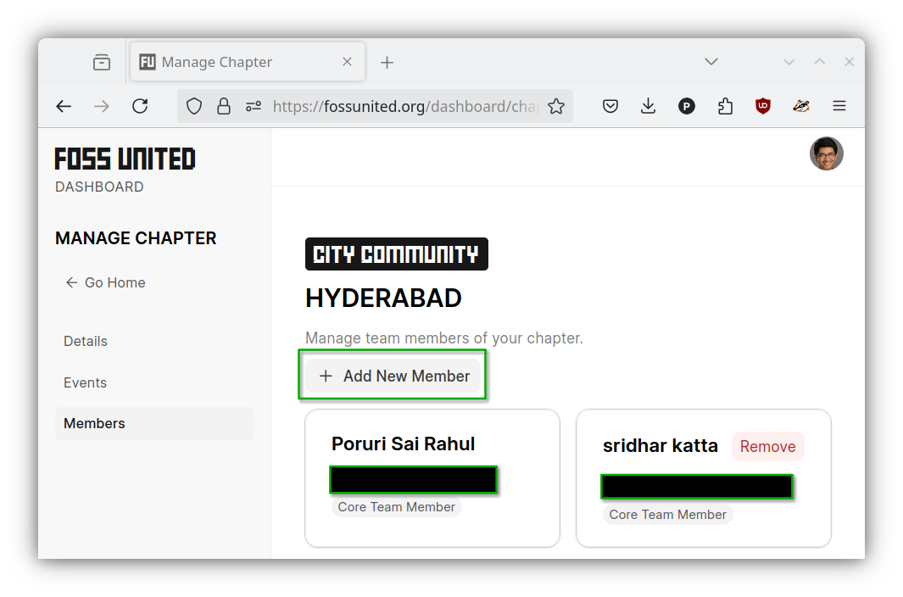
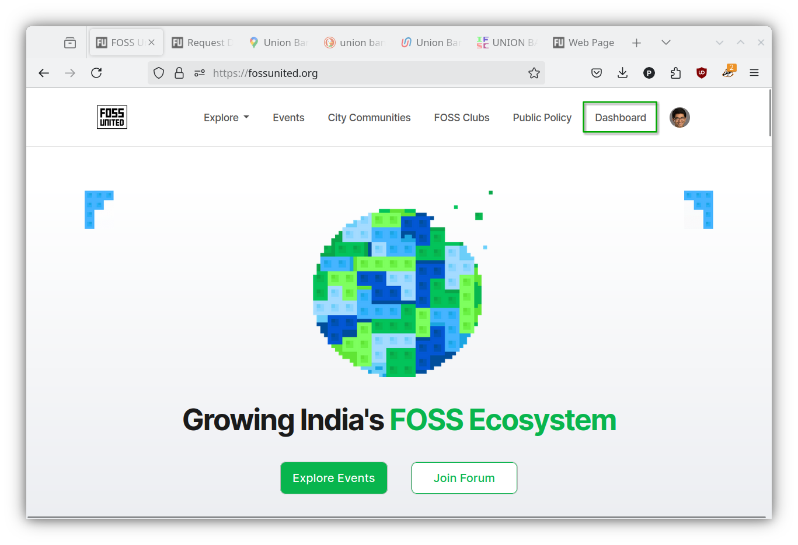
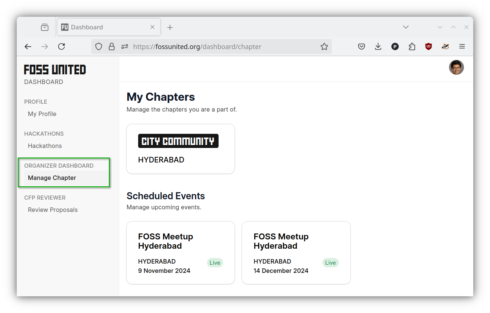

# Volunteering in the FOSS United Community

Volunteers bring life to the FOSS United Community. A handful of people at the
FOSS United Foundation are able to work with hundreds of active volunteers
from across the country to organize the various activities that you see in the
FOSS United Community.

Volunteers schedule events, find event venues, promote the events via social
networks, put out a call for proposals, request interesting speakers to submit
proposals, coordinate with reviewers to finalize the schedule of the events,
handle logistics of the event on the ground, communicate what went well
and what did not with the rest of the Community, and more.

Volunteering is not to be taken lightly. Volunteers in the Community routinely
spend 10-20+ hours every month. As volunteers, you are held to a higher
standard than the rest of the Community, given your ability to mould and drive
the Community.

If you are interested in volunteering with a city chapter, reach out to one of
the existing volunteers. If you are a volunteer with a chapter, you should be
able to add another volunteer from the `"Members"` page on the Dashboard.

If you are interested in starting a new city chapter
or restarting one that already exists, or starting a new student club, reach
out to us at the Foundation.

The [Dashboard](https://fossunited.org/dashboard) is the control center for
volunteer tasks. Once you're added as a volunteer, you should be able to
manage the chapter.

