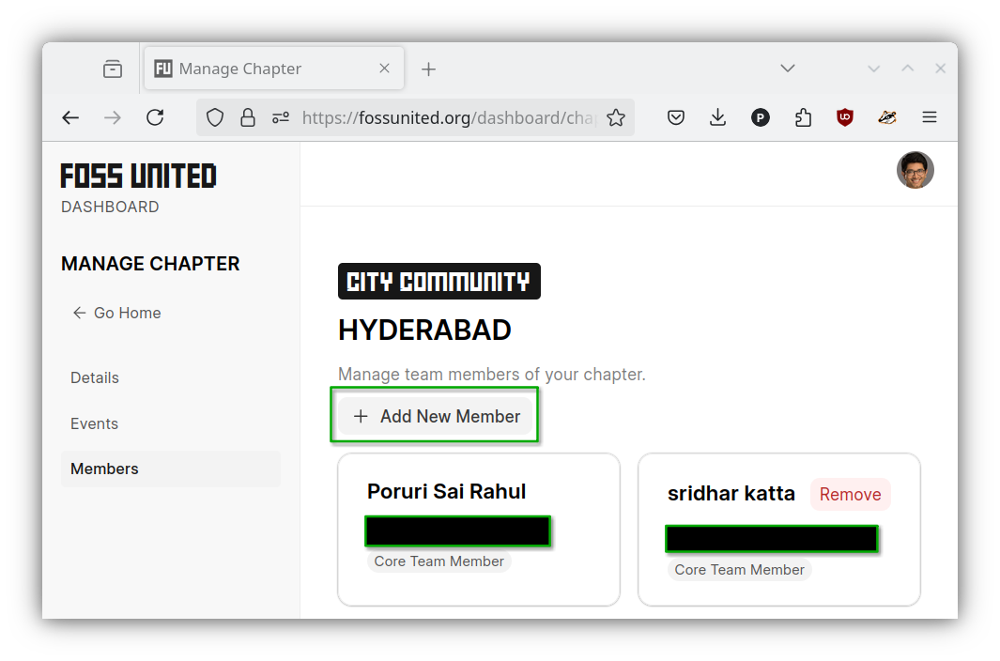
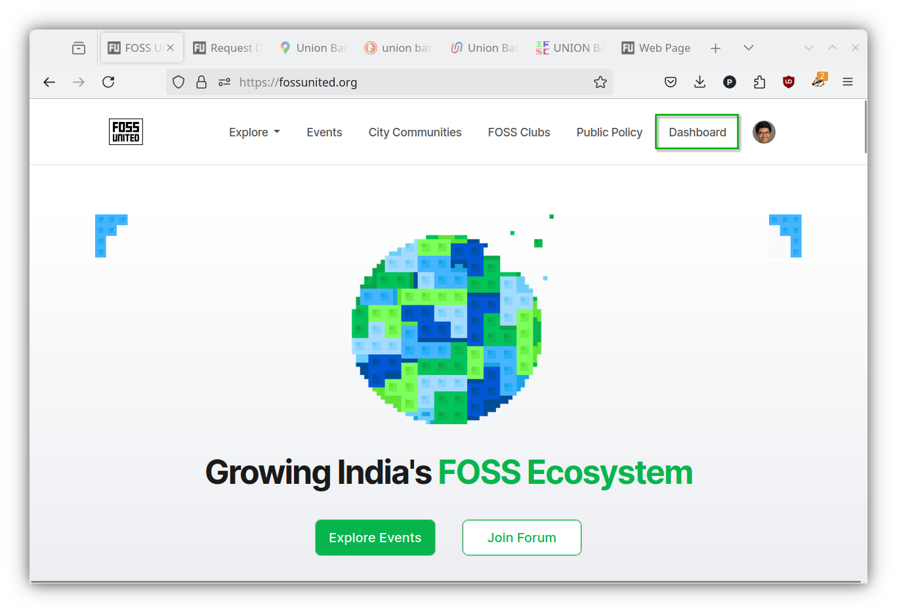
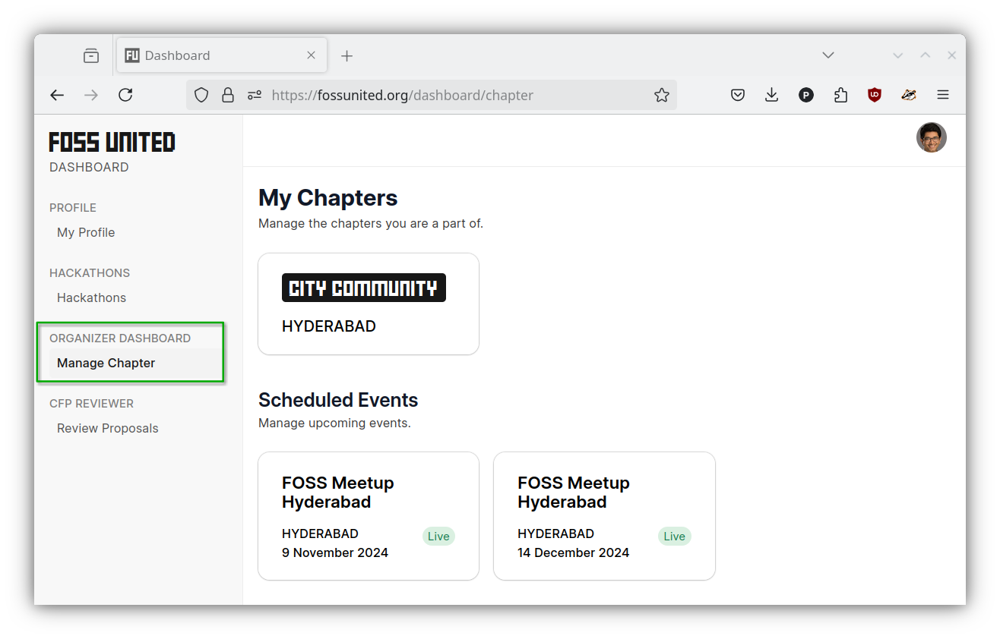

# Volunteering in the FOSS United Community

Volunteers are the backbone of the FOSS United community. While the FOSS United Foundation has a small core team, it's the energy and dedication of hundreds of volunteers across the country that bring our initiatives, events, and programs to life.

---

## Why Volunteer?

Volunteering at FOSS United offers an opportunity to:

- Contribute to the open-source movement in India
- Learn and grow alongside like-minded individuals
- Develop leadership and organizational skills
- Build a network with contributors, developers, and professionals from across the country

Read more on [perks of volunteering](volunteering-perks.md).

However, volunteering is a serious commitment. Many active volunteers contribute 10–20 hours (or more) each month. Volunteers are held to a higher standard within the community because of their role in shaping and sustaining it.

---

## What Do Volunteers Do?

Volunteers are involved in many aspects of running FOSS United activities. Some typical responsibilities include:

- Organizing and promoting events (meetups, conferences, hackathons)
- Finding venues, handling logistics, and managing operations on the ground
- Putting out calls for proposals and coordinating with speakers
- Engaging with attendees and gathering feedback
- Designing posters, banners, and other creative assets
- Promoting events and initiatives on social media
- Reporting what went well and areas for improvement

---

## Volunteering Roles and Opportunities

Volunteers can contribute in a wide variety of ways. Here are some of the main areas where your skills and time can make an impact:

1. **Event Organization**
   Help plan and execute events such as FOSS Hack, IndiaFOSS, and local meetups.

2. **Community Engagement**
   Participate in discussions on the [FOSS United Forum](https://forum.fossunited.org/), answer questions, welcome new members, and keep the community active and welcoming.

3. **Design and Creativity**
   Create visual assets like posters, logos, slide decks, or social media graphics using standard templates and FOSS United branding.
   Refer to the [design templates by the Chennai team](https://forum.fossunited.org/t/foss-united-events-design-templates/2820) for inspiration.

4. **Marketing and Outreach**
   Help promote events, write blog posts, manage newsletters, and grow the community on platforms like [LinkedIn](https://www.linkedin.com/company/fossunited/), and [Instagram](https://instagram.com/fossunited).

5. **Educational Programs**
   Contribute to initiatives like [FOSS Clubs](https://fossunited.org/clubs) through mentoring, content creation, or coordination.

6. **Public Policy and Advocacy**
   Support our work on [open-source policy](https://fossunited.org/public-policy), government engagement, and research. Read

7. **Fundraising and Financial Support**
   Assist in sponsorship efforts, donor communications, or event budgeting.
   - Companies can join as [industry partners](https://fossunited.org/partners)
   - Individuals can donate [any amount](https://pages.razorpay.com/fossunited) (donations are eligible for 80G and CSR tax benefits)

8. **Code Contributions**
   Developers can contribute code to projects supported by FOSS United or help maintain tools used by the community. Check out [forklore.in](https://forklore.in).

9. **Propose Your Own Contribution**
   Have a unique skill or project idea? We’re open to custom contributions that align with our mission.

Interested? Reach out to us on [team@fossunited.org](mailto:team@fossunited.org).

---

## How to Get Started

### Join a City Chapter

If you're interested in volunteering with a local chapter:

- Reach out to existing volunteers from the chapter
- If you're already a chapter volunteer, you can add others via the **"Members"** tab on the [Dashboard](https://fossunited.org/dashboard)

### Start or Restart a Chapter or Club

Interested in starting a new city chapter or reviving an existing one? Want to set up a FOSS Club at your educational institution?
Reach out to the FOSS United Foundation team directly by [booking a call](https://cal.com/team/fossunited/learners-program).

---

## Tools and Platforms

### Dashboard

Once you're on-boarded as a volunteer, the [Dashboard](https://fossunited.org/dashboard) becomes your central tool to manage tasks, events, members, and chapters.

### Chapter Management

Manage city-specific tasks, track event planning, and collaborate with other volunteers from the **Manage Chapter** section.

---

## Learn More

To explore current volunteering opportunities and responsibilities in detail, check out this forum thread:
[Draft: Tasks and Responsibilities Overview - FOSS United Foundation](https://forum.fossunited.org/t/draft-tasks-and-responsibilities-overview-foss-united-foundation/2666)

Also, visit:
[How can I contribute to FOSS United?](https://forum.fossunited.org/t/how-can-i-contribute-to-foss-united/1612)

---

Volunteering at FOSS United is a chance to be part of something bigger, to help build a sustainable, inclusive, and impacting open-source ecosystem in India. Whether you're a student, professional, designer, developer, or educator, there’s a place for you here.
